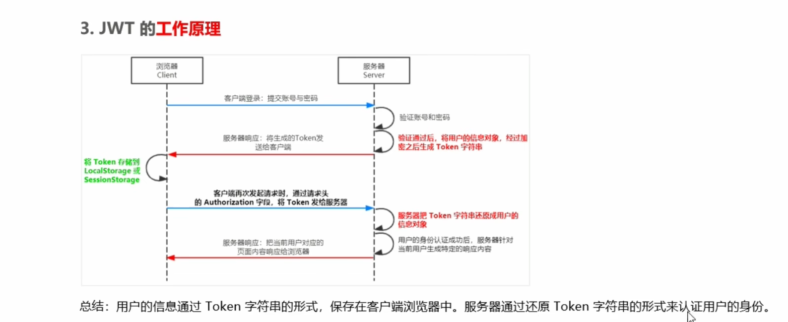

<!--
 * @Author: xujie 1607526161@qq.com
 * @Date: 2022-04-22 13:10:58
 * @LastEditors: xujie 1607526161@qq.com
 * @LastEditTime: 2023-02-20 22:30:04
 * @FilePath: \HTML-CSS-Javascript-\HTML+CSS\HTML部分\HTML基础\本地存储和身份认证.md
 * @Description: 本地存储和身份认证
-->
# 本地存储

## Cookie

* Cookie 会根据从服务器端发送的响应报文内的一个叫做 Set-Cookie 的首部字段信息，通知客户端保存 Cookie。当下次客户端再往该服务器发送请求时，客户端会自动在请求报文中加入 Cookie 值后发送出去。
* 服务器端发现客户端发送过来的 Cookie 后，会去检查究竟是从哪一个客户端发来的连接请求，然后对比服务器上的记录，最后得到之前的状态信息。

## cookie解决什么问题

* HTTP 是无状态的，但随着 Web 的不断发展，这种 无状态 的特性出现了弊端。当你登录到一家购物网站，在跳转到该站的其他页面时也应该继续保持登录状态。但是因为 HTTP 是无状态的，所以必须得在浏览器端存储一些信息来标识当前用户，因此 cookie 应运而生，它一种浏览器管理状态的文件。

### cookie特点

* 大多数浏览器只支持不超过 4k 的 Cookie。 浏览器限制用户计算机上存储的 Cookie 的数量，大多数只允许每个站点存储 20 个，如果存储更多，则最旧的 Cookie 将会被废弃，有些浏览器还会对来自所有站点的 Cookie 总数进行限制，通常为 300 个。
* Cookie 默认情况都会随着 Http 请求发送到后台服务器(cookie 适合用来存放身份信息)，但并不是所有请求都需要 Cookie 的，比如：js、css、图片等请求则不需要 cookie。
* 安全性低， 可以根据本地的 cookie 进行 cookie 欺骗。
* cookie 是保留在浏览器端的，移动设备不支持使用 Cookie

### cookie 和 HTTP 协议

### 属性和字段

* expires: 设置过期时间，值是一个时间点。
* max-age: 设置过期时间，值为创建时间加上一个以秒为单位的数值。
* 如果不设置过期时间，当浏览器关闭进程的时候自动销毁。

* domain： 指定了cookie将要被发送至哪个域名中。(默认值为创建 cookie 的服务器的域名)
* path: 指定 cookie 将要被发送至服务器的哪个文件目录下。(默认值为服务器文档所在的目录)
* domain 是域名，path 是路径，两者加起来就构成了 URL，domain 和 path 一起来限制 cookie 能被哪些 URL 访问。所以 domain 和 path 2 个选项共同决定了 cookie 何时被浏览器自动添加到请求头部中发送出去。如果没有设置这两个选项，则会使用默认值。domain 的默认值为设置该 cookie 的网页所在的域名，path 默认值为设置该 cookie 的网页所在的目录

* httpOnly： 用来设置 cookie 是否能够通过 js 来访问。只有服务端才可以设置这个字段
* secure： 用来设置 cookie 只有在请求是 https 或者其他安全协议时。cookie 才会被发送。

## session

### session的特点

* session 存储在服务器端
* session 大小没有限制
* 安全性大于 cookie
* session 代表着服务器和客户端的一次会话的过程，session 一般保存时间都很短，客户端关闭或者 session 超时都会关闭。

### session 的缺点

* session 保留东西越多，越占用服务器内存
* 服务端执行 session 机制的时候，会把生成的 sessionId 的值传递给客户端，客户端需要把 sessionId 存储在 cookie 中，每次会被放到 http 的头部发送给服务器。所以 session 是依赖于 cookie 的。禁用 cookie 的话，session 也会无法正常运作。

## 如果禁用 cookie 的话，如何实现验证

1. 每次请求的 url 上都携带对应的 sessionId。
2. 使用 token 机制，一种类似于 cookie 的机制，由服务端生成，客户端在每次发请求的时候携带 token。

### Token

* Token 是服务端生成的一串字符串。当第一次登录后，服务器生成一个 Token 便将此 Token 返回给客户端，以后客户端只需带上这个 Token 前来请求数据即可，无需再次带上用户名和密码。为了减轻服务器的压力，减少频繁的查询数据库，
* 服务端需要用算法来处理浏览器发过来的 Token，验证 Token 的合法性。

## JWT认证机制

* JWT 会在服务端验证账号密码通过之后，将用户的身份信息加密成 Token 字符串然后发送给客户端，客户端使用 SessionStorage 或者 localStorage 存储
* 客户端在每次请求时将 Token 通过 Authorization 字段的形式发送给服务端
* 服务端收到 Token 之后，先进行解密，在进行验证
* JWT 通常由三部分组成：Header，Payload，Signature。 三者之间使用 . 分隔： Header.Payload.Signature
* Payload 部分是用户信息经过加密过后的字符串， Header 和 Signature 是保证 Token 安全性的

## webStorage

* HTML5 实现了这两个 api
* 存储数据的大小一般都是 5MB
* 都保留在客户端，不和服务器进行交互通信。
* 只能存储字符串类型，复杂的对象需要使用 JSON 的 stringify 和 parse 来处理
* 使用 window.sessionStorage window.localStorage 获取

### sessionStorage 会话级别的存储

* 生命周期和当前浏览器会话有关系，当会话结束后(浏览器页面关闭)数据会自动清除，和未设置过期时间的 Cookie 类似。
* 适用于敏感账号登录

### localStorage 永久本地存储

* 生命周期是永久的，除非手动删除数据
* 仅存放在客户端中保存，不参与和服务器的通信
* 适用于长期登录验证。

* localStorage.setItem('key','value'); 以键值对的形式把数据添加到本地中
* localStorage.getItem('key');  通过key值来获取本地的数值
* localStorage.removeItem(key) 通过key值来删除本地的数据
* localStorage.clear( )清空数据

* 本地存储没有数据时 getItem 的返回值为 null，所以需要验证一下。return cards == null ? [] : cards;
