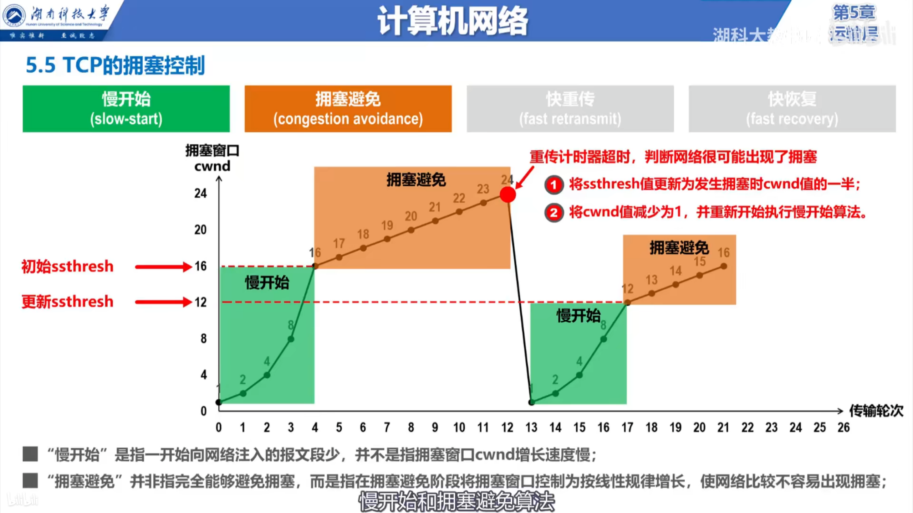
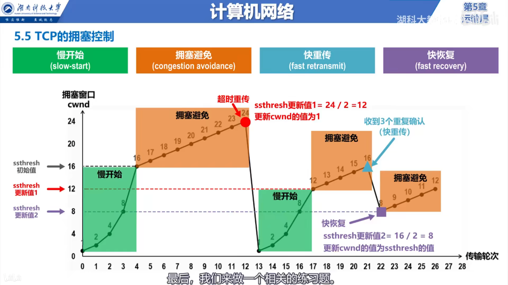
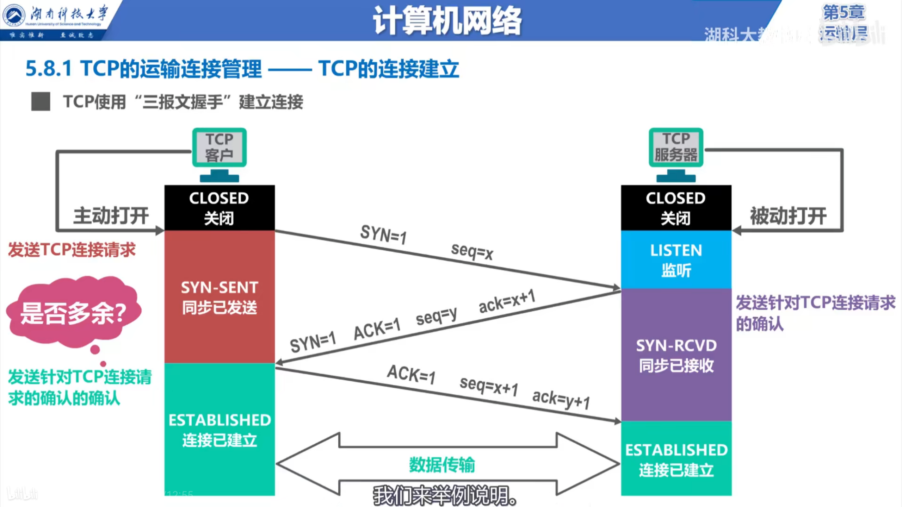
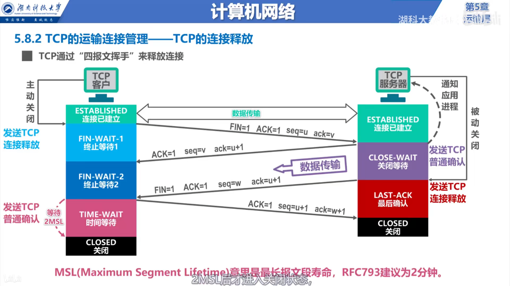

# 运输层

* 物理层，数据链路层，网络层他们共同解决了将主机通过异构网络互联起来所面临的的问题，**实现了主机到主机的通信**
* 但是实际上在计算机网络中进行通信的真正实体是位于通信两端主机中的进程。
* 如何为运行在不同主机上的应用进程提供直接的通信服务是运输层的任务，运输层协议又称为**端到端协议**。

## 运输层端口号

* 因为因特网上的计算机 并不是统一的操作系统(windows,Linux,MAC)，不同的操作系统使用不同格式的进程标识符。所以需要使用统一的方法对TCP/IP体系的应用进程进行标识。
* 常见端口号 FTP：21/20    HTTP: 80    DNS: 53   HTTPS: 443

## 在浏览器中输入域名后发生的事情

* 用户PC的DNS客户端进程发送一个DNS查询请求报文。使用运输层的UDP协议将DNS查询请求报文封装为UDP用户数据报，在添加的UDP首部中填写源端口和目的端口。(源端口使用本机的短暂端口，目的端口使用熟知的53)
* 然后将UDP用户数据报封装在IP数据报中，通过以太网进行发送到DNS服务器。
* DNS服务器接收到该数据报后，解封成UDP用户数据报，识别UDP首部中目的端口号，然后将该数据报交付给本服务器中的DNS服务器端进程。
* DNS服务器端进程处理完之后发送响应数据报......

* 用户PC得到对应的ip地址后，用户PC的HTTP客户端进程向Web服务器发送HTTP请求报文。HTTP请求报文需要使用运输层的TCP协议封装成TCP报文段。在添加的TCP首部中填写源端口和目的端口。(源端口使用本机的短暂端口，目的端口使用熟知的80)
* 然后将TCP报文段封装成IP数据报，通过以太网发送到Web服务器。
* Web服务器接收到该数据报后，解封成TCP报文段，识别TCP首部中目的端口号，然后将该数据报交付给本服务器中的HTTP服务器端进程。
* HTTP服务器端进程处理HTTP请求报文，然后给HTTP客户端发送响应报文。

## UDP(用户数据报协议)和TCP(传输控制协议)对比

* UDP在发送数据时，可以随时发送数据(无连接)
* TCP在传输数据时，必须使用三报文握手建立连接，使用四报文挥手来释放TCP连接。(面向连接)
* UDP支持单播，多播和广播。
* TCP仅仅支持单播
* UDP是面向报文的，运输层的UDP协议直接在应用层交付的数据上加上首部。不拆分数据。(面向报文的)
* TCP是面向字节流的，运输层的TCP协议把应用层交付的数据分割成TCP报文段。(面向字节流的)
* UDP向上层提供的是无连接不可靠的传输服务(适用于IP电话，视频会议等实时应用)
* TCP向上层提供面向连接的可靠传输服务。(适用于文件传输等)

## TCP协议

### TCP流量控制

* 控制发送方的发送速度，以免发送数据的速度过快，导致接收方来不及全部接收。

### TCP的拥塞控制

* 对网络中某一个资源的需求超过了该资源所能提供的可用部分，网络性能就要变坏，这种情况就叫做拥塞。
* 四种算法： 慢开始，拥塞避免，快重传，快恢复(拥塞窗口大小的意思就是，一次发送能发送TCP报文段的个数)

* 在发生重传计时器超时时，有可能是出现了拥塞，也有可能是出现了报文段的丢失，不搞清楚是什么原因发生了重传计时器超时就直接降低拥塞窗口的大小会降低效率。采用**快重传算法**来区别是发生了拥塞还是发生了丢失，可以有效提高传输效率。
* 快恢复算法： 当使用快重传算法发现有个人报文段丢失时，不在启动**慢开始算法**，而是启动**快恢复算法**。快恢复算法不会直接把拥塞窗口大小直接改为1，而是改为当前窗口大小的一半。

### TCP超时重传时间的选择

* 因为情况的复杂性，需要使用科学的算法来计算出合理的TCP超时重传时间。

## TCP的连接建立

### 使用三报文握手来建立TCP连接

同步位SYN    序号字段seq   确认位ACK    确认号字段ack

* 使用三次握手来建立TCP连接是为了防止已失效的连接请求报文段突然又传送到了TCP服务器。进而导致错误。
  
### 数据传送

### 使用四报文挥手来释放TCP连接

终止位FIN

* 前两次的挥手是为了关闭从客户端到服务端的TCP连接，两次挥手之后服务器仍然可以给客户端发送少量数据。
* 后两次的挥手是为了关闭从服务端到客户端的TCP连接，至此TCP连接才真正释放。

