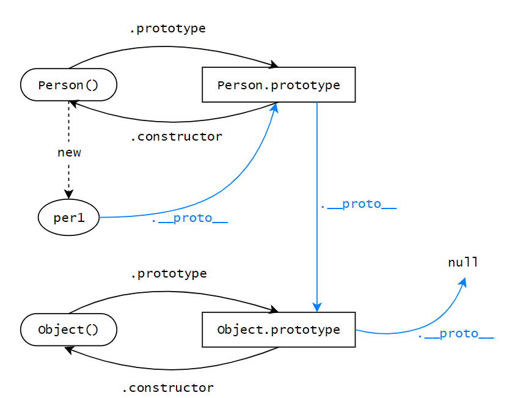

<!--
 * @Author: x09898 coder_xujie@163.com
 * @Date: 2022-05-09 20:54:22
 * @LastEditors: x09898 coder_xujie@163.com
 * @FilePath: \HTML-CSS-Javascript-\JAVAScript+ES6\JavaScript\JavaScript对象，原型\原型 原型链.md
 * @Description: 
-->
# 原型链 原型

* __proto__, constructor属性是对象所独有的
* prototype 属性是函数所独有的
* 但是函数是对象的一种，所以函数也有 __proto__, constructor属性
  

* constructor(可以手动改变)是原型中的一个属性
* [[Prototype]]是对象的隐藏私有属性，指向的就是对象的构造函数的原型。但是不能直接通过[[Prototype]]来读原型。所以目前有两种方式来读写原型。(目前对于[[Prototype]]的结构仍有疑问，目前不要通过浏览器中的[[Prototype]]来查看原型链结构，使用__proto__来看原型链的结构)
   1. 是通过ES6标准方法Object.getPrototypeOf来获取它的值，用函数Object.setPrototypeOf来改变它的值。
   2. 使用JS标准中并没有定义，但是各大浏览器厂商已经实现的__proto__属性来读写原型

* 准则一: 构造函数的原型对象的 constructor 属性指向构造函数自身
* 准则二：实例的 __proto__ 和构造函数的原型对象指向同一个地方

1. Person.prototype本质也是一个实例(对象实例)，是由new Object()得到的，所以Person.prototype.__proto__ == Object.prototype。
2. function Person()本质上是一个实例(函数实例)， 是由new Function()得到的，所以Person.__proto__ == Function.prototype;

## 构造函数内部原理三段论的深入理解

var this = Object.create(Person.prototype)
var this = {
     __proto__: Person.prototype

}
只有第一步不一样   隐式的构造的this对象，并不是真的空的。里面有__proto__指向构造函数的原型(所以说具体的对象是从__proto__指向的空间里取值，而不是一定从Person.prototype地址中取数据。因为__proto__地址的指向可以人为改变，导致不指向系统自动生成的原型。)

## 原型链

* 原型链：Object.prototype 是绝大多数对象(因为Object.create(null)的存在)的原型链终点(里面有很多属性)。
* Object.prototype 没有 __proto__ 了，因为它是终点。
* 手动定义的原型链因为原型是构造函数的实例，实例上有__proto__ 属性指向他的构造函数的原型，但是手动定义的原型链一定会有一个终点，比如一个 Person 构造函数是手动定义的终点，但是这个构造函数的原型里面也有一个 __proto__ 属性，指向 Object 的原型，这个是因为系统自带的。

### 原型链上的属性更改

* 原型链上的属性一般来说都不可以通过子代来进行增删改查。
* 原型链可以通过子代修改父类的对象类属性。这是引用值自己的修改。这是一种调用方法的修改。

## Object.create()

* var obj1 = Object.create(原型);
* 就会把原型参数当做obj1的原型 不可以手动添加原型，但可以手动修改已有原型。

* var obj = Object.create(null); 这个对象没有任何的继承下来的方法可以使用。
* obj是没有原型的，手动加上原型是没有用的。

* undefined 就是一个原始值，它没有原型，所以没有 toString方法
* null 也没有原型，也没有 toString

## toSting()方法

1. Object 有 toString 方法，它底下的 Number ，String，Array 等包装类都重写了 toString 方法，所以不同类型的数据调用 toString 方法输出各异。
2. document.write 其实隐式调用了 toString 方法
