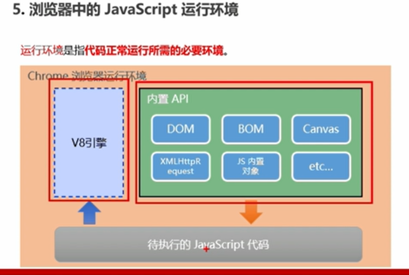

<!--
 * @Author: xujie 1607526161@qq.com
 * @Date: 2022-04-22 13:10:58
 * @LastEditors: xujie 1607526161@qq.com
 * @FilePath: \HTML-CSS-Javascript-\JAVAScript+ES6\JavaScript\JavaScript的历史\JavaScript简介.md
 * @Description: JavaScript语言的特性
-->
# JavaScript简介

## JavaScript的问世

* 在js问世之前，表单数据的验证只能在服务端进行。js使得在客户端也能完成一些基本的验证任务。
* 如今已经能处理复杂的计算和交互。
* js是客户端语言
* javascript包括三大部分，ECMAScript,DOM，BOM

## ECMAScript

* 两个公司的两个版本的javascript语言备受业界关注，ECMA协会制定了一个名为ECMAScript的标准。
* ECMA定义的只是这门语言的基础，在此基础上可以构建更加完善的脚本语言。
* web浏览器只是ECMAScript实现的宿主环境之一，宿主环境提供基本的ECMAScript的实现，同时也会提供扩展，例如DOM，BOM。其他的宿主环境还有(node)
* ECMA标准没有参照浏览器，而是规定了语言的语法，类型，语句，关键字，保留字，操作符，对象。
* ECMAScript就是对实现了该标准的规定的各个方面内容的语言的描述(javascript和ActionScript都实现了该标准)
* ECMAScript的前两个版本没有很多重要的变化，第三个版本才是一次真正意义上的修改涉及到了很多内容，因此第三版标志着ECMAScript成为了一门真正的编程语言
* 2009年发布了ECMAScript的第五个版本。

### ECMAScript兼容

* 规定了要想成为ECMAScript，有哪些必须要遵从，有哪些可以进行扩展。
* 为开发人员基于ECMAScript的开发一门新语言提供的广阔的空间和极大的灵活性。

## JavaScript语言的特点

1. 解释语言
2. 单线程（论转时间片）
3. ECMA标准 js原生也称为ECMAScript。三大核心：ECMAScript + DOM + BOM（后两个由浏览器提供）

### js是弱处理性语言

1. case里的数据类型完全可以不一样（和其他强类型语言不一样）
2. 数组内的数据类型可以是完全不同的数据类型 var arr=[1,2,"abd",undefined]

### 函数一等公民

* JavaScript中采用函数式编程的方式,函数的作用十分强大

### 基于原型的面向对象

* 不同于其他主流语言(c#, java等(基于类的面向对象))，JavaScript使用基于原型的面向对象
  
### javascript的垃圾回收

* javascript会进行自动的内存回收，所以不必关心内存管理问题
* 标记清除法，常用策略。
* 引用计数法，有很大的问题，其中常见的为循环引用。导致该策略性能较低

### 开发语言的特点

* 编译语言： 先通篇翻译之后，执行翻译完的文件: c c++   速度快 用于底层实现，游戏     移植性不好

* 解释语言： 看一行翻译一行执行一行（不需要生成别的文件）: php js   速度稍微慢一点 稳定性极高    跨平台（极大的优点）

* java 先编译后解释 因为java虚拟机的存在 : .java ----java c --编译--.class--jvm(虚拟机)--解释执行

## 浏览器中JavaScript的运行环境

* 在chrome浏览器运行环境中，v8是chrome浏览器中的js解析引擎
* 内置API: DOM BOM js内置对象 Canvas等等(内置API是由运行环境提供的特殊接口，只能在所属的运行环境中被调用，浏览器有自己的API，Node也有自己的一套API)(在浏览器环境中利用浏览器提供的事件来操作DM，在Node环境中利用Node提供的事件来操作IO)
* 待执行的js代码(程序员在浏览器中编写js代码的时候，会使用浏览器内置的API)(也就是说DOM的方法， BOM的方法，还有js中各种构造函数和方法都是内置在浏览器中的)

