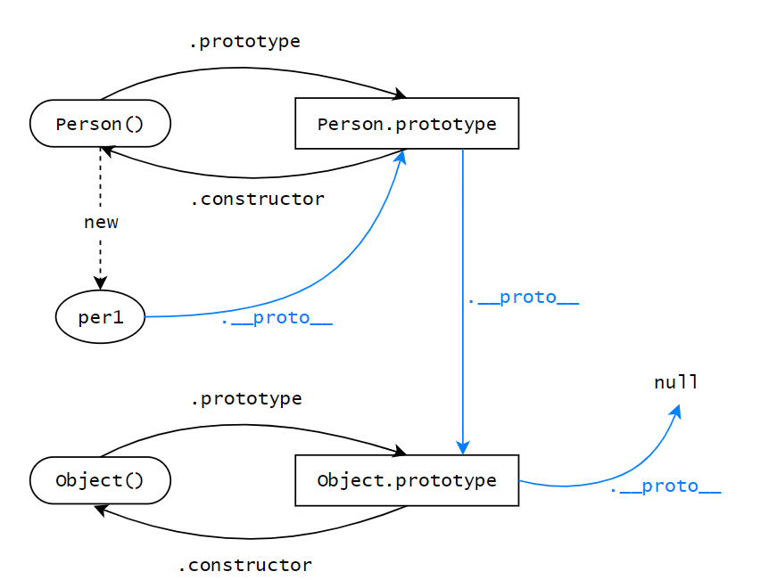

<!--
 * @Author: x09898 coder_xujie@163.com
 * @Date: 2022-05-09 20:54:22
 * @LastEditors: xujie 1607526161@qq.com
 * @FilePath: \HTML-CSS-Javascript-\JAVAScript+ES6\JavaScript\JavaScript对象，原型\原型 原型链.md
 * @Description: 
-->
# 原型链 原型

* __proto__, constructor 属性是对象所独有的
* prototype 属性是函数所独有的
* 但是函数是对象的一种，所以函数也有 __proto__, constructor 属性
  


* constructor(可以手动改变)是原型中的一个属性
* [[Prototype]]是对象的隐藏私有属性，指向的就是对象的构造函数的原型。但是不能直接通过[[Prototype]]来读原型。所以目前有两种方式来读写原型。(目前对于[[Prototype]]的结构仍有疑问，目前不要通过浏览器中的[[Prototype]]来查看原型链结构，使用__proto__来看原型链的结构)
   1. 是通过 ES6 标准方法 Object.getPrototypeOf() 来获取原型，用函数 Object.setPrototypeOf() 来设置原型。
   2. 使用 JS 标准中并没有定义，但是各大浏览器厂商已经实现的 __proto__ 属性来读写原型

* 准则一: 构造函数的原型对象的 constructor 属性指向构造函数自身
* 准则二：实例的 __proto__ 和构造函数的原型对象指向同一个地方

1. Person.prototype 本质也是一个实例(对象实例)，是由 new Object() 得到的，所以 Person.prototype.__proto__ == Object.prototype。
2. function Person() 本质上是一个实例(函数实例)， 是由 new Function()得到的，所以 Person.__proto__ == Function.prototype;

## 构造函数内部原理三段论的深入理解

```js
// 通过 Object.create() 创建对象
var this = Object.create(Person.prototype)
// 生成对象的内部结构
var this = {
  __proto__: Person.prototype
}
```

1. 只有第一步不一样
2. 隐式的构造的 this 对象，并不是真的空的。里面有 __proto__ 指向构造函数的原型
3. 生成的对象实例从 __proto__ 指向的空间里取值，而不是一定从 Person.prototype 地址中取数据。因为 __proto__ 地址的指向可以人为改变，导致不指向系统自动生成的原型

## 原型链

* 原型链：Object.prototype 是绝大多数对象( 因为Object.create(null)的存在 )的原型链终点
* Object.prototype 的 __proto__ 是 null

### 原型链上的属性更改

* 原型链上的属性一般来说都不可以通过子代来进行增删改查。
* 原型链可以通过子代修改父类的对象类属性。这是引用值自己的修改。这是一种调用方法的修改。

### 确定原型和实例的关系

* 使用 instanceof()  来测试实例的原型链中是否出现过该构造函数 (person instanceof Person)
* 使用 isPrototype() 来测试实例的原型链中是否出现过该原型(Person.prototype.isPrototype(person))

## Object.create()

* var obj1 = Object.create(原型);
* 就会把原型参数当做 obj1 的原型 不可以手动添加原型，但可以手动修改已有原型。

* var obj = Object.create(null); 这个对象没有任何的继承下来的方法可以使用。
* obj 是没有原型的，手动加上原型是没有用的。

* undefined 就是一个原始值，它没有原型，所以没有 toString() 方法
* null 也没有原型，也没有 toString()

## toSting()方法

1. Object 有 toString 方法，它底下的 Number ，String，Array 等包装类都重写了 toString 方法，所以不同类型的数据调用 toString 方法输出各异。
2. document.write 其实隐式调用了 toString 方法
