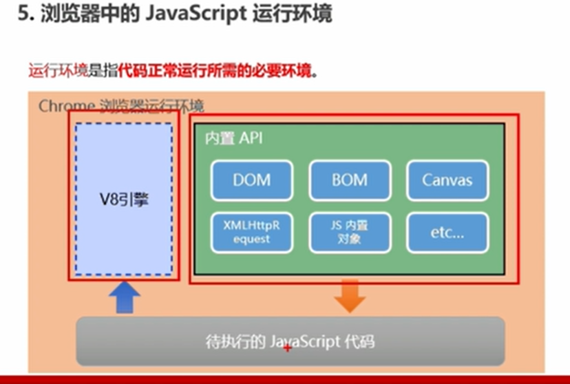

# JavaScript简介

## ECMAScript

* 两个公司的两个版本的 javascript 语言备受业界关注，ECMA 协会制定了一个名为 ECMAScript 的标准。
* ECMAScript 定义的只是这门语言的基础(规定了语言的语法，类型，语句，关键字，保留字，操作符，对象)，在此基础上可以构建更加完善的脚本语言。
* WEB 浏览器只是 ECMAScript 实现的宿主环境之一，宿主环境提供基本的 ECMAScript 的实现，同时也会提供扩展，例如 DOM，BOM。其他的宿主环境还有(node)

## JavaScript语言的特点

1. 解释语言
2. 单线程
3. ECMA标准 JS 原生也称为 ECMAScript。三大核心：ECMAScript + DOM + BOM（后两个由浏览器提供）

### js是弱处理性语言

1. case 里的数据类型完全可以不一样（和其他强类型语言不一样）
2. 数组内的数据类型可以是完全不同的数据类型 var arr = [1, 2, "abd", undefined]

### 函数一等公民

* JavaScript 中采用函数式编程的方式, 函数的作用十分强大

### 基于原型的面向对象

* 不同于其他主流语言(c#, java等(基于类的面向对象)), JavaScript 使用基于原型的面向对象

### 开发语言的特点

* 编译语言： 先通篇翻译之后，执行翻译完的文件: c c++   速度快 用于底层实现，游戏   移植性不好
* 解释语言： 看一行翻译一行执行一行（不需要生成别的文件）: php JS 速度稍微慢一点  稳定性极高    跨平台（极大的优点）
* java 先编译后解释 因为 java 虚拟机的存在: .java -> 编译 -> .class ->jvm(虚拟机中解释执行)

## 浏览器中JavaScript的运行环境

* 在 chrome 浏览器运行环境中，v8 是 chrome 浏览器中的 JS 解析引擎
* 内置 API: DOM-BOM-JS内置对象等等(内置 API 是由运行环境提供的特殊接口，只能在所属的运行环境中被调用，浏览器有自己的 API，Node 也有自己的一套 API )(在浏览器环境中利用浏览器提供的事件来操作 DOM，在 Node 环境中利用 Node 提供的事件来操作 IO)
* 待执行的 JS 代码(程序员在浏览器中编写 JS 代码的时候，会使用浏览器内置的 API)(也就是说 DOM 的方法, BOM的方法，还有 JS 中各种构造函数和方法都是内置在浏览器中的)

### 小结

* javascript是一种专门为了与网页进行交互而设计的脚本语言

1. ECMAScript 核心语言功能
2. 文档对象模型(DOM)提供访问和操作网页内容的方法和接口
3. 浏览器对象模型(BOM)提供与浏览器交互的方法和接口
