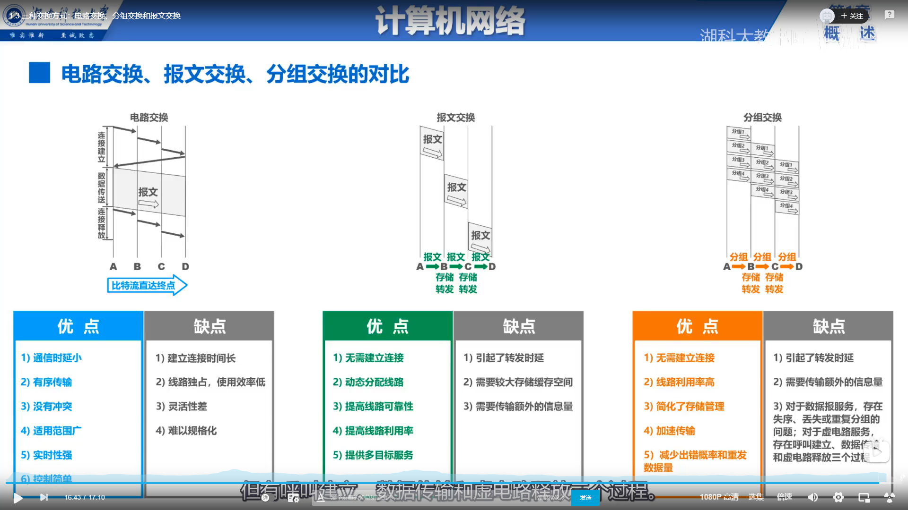
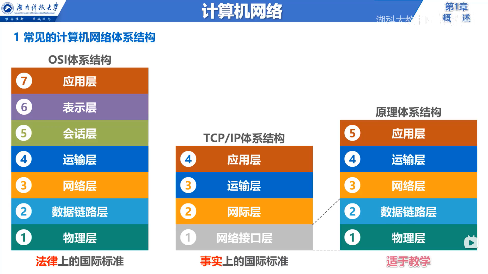
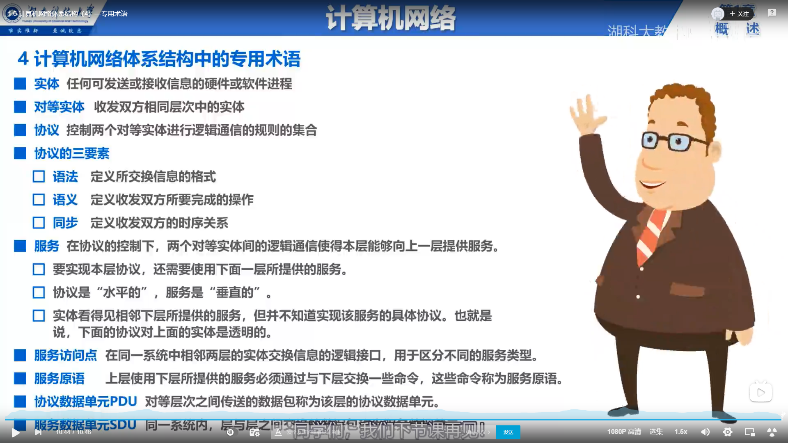

# 计算机网络的基础知识点

## 三种交换方式

## 计算机网络的性能指标

### 速率

* 一个比特(bit)就是一个0或者1  8bit = 1Byte(B) KB = 2的十次方B
* bit/s(b/s,bps)  kb/s = 10的三次方 b/s
* 速率中的b是1比特  大小中的B是8比特

### 带宽

* 表示通信线路所能传递数据的最高数据率
* 带宽就像马路的宽度，速率就是真实在路上跑的汽车和时间的比值

### 吞吐量

* 单位时间内通过某个网络的数据量

### 时延

* 发送时延 传播时延 处理时延
* 发送时延中的发送速率取决于网卡的发送速率，信道带宽，接口速率中的最小值(木桶效应)

### 时延带宽积

* 等于传播时延乘以带宽(类似于求圆柱体的体积)

### 往返时间

### 利用率

* 利用率在50%时比较好，既不浪费通道资源，也不会因为利用率太高而导致时延过大

### 丢包率

* 网络拥塞过高会导致过高的丢包率

## 计算机网络体系结构

## MAC地址 IP地址 ARP地址

* MAC地址(物理地址)

* MAC地址是以太网的MAC子层所使用的地址，属于数据链路层
* 每个网络适配器都有一个全球唯一的MAC地址。MAC是对网络上各接口(设备有多个网卡的话就会有多个MAC地址)的唯一标识，而不是对网络上各设备的唯一标识。

* IP地址

* 属于TCP/IP协议结构网际层所使用的的地址
* IP地址分为网络编号和主机编号
* 每个网络都有唯一的编号(路由器的作用就是连接不同的网络)，一起连接在同一个网络上的不同主机或者路由器的IP地址网络编号前缀是相同的，后面的主机编号是不同的。

* ARP协议

* 属于TCP/IP协议结构网际层，作用是通过IP地址找到MAC地址。
* ARP协议发送请求报文(使用广播地址FF-FF-FF-FF)来获取对应ip地址的MAC地址。
* ARP协议只能在一段链路或者一个网络上进行使用，不能跨网络使用。

MAC地址必须是在同一个网络中，IP地址是网络的网络。
在数据传输过程中，源IP地址始终不变，MAC地址必须是相邻的地址
