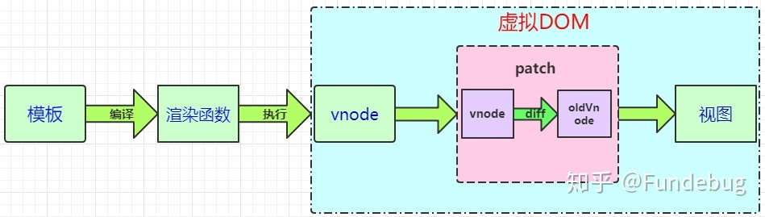

<!--
 * @Author: xujie 1607526161@qq.com
 * @Date: 2022-04-22 13:11:00
 * @LastEditors: x09898 coder_xujie@163.com
 * @FilePath: \HTML-CSS-Javascript-\Vue框架\Vue的教程\列表渲染.md
 * @Description: 
-->
# 列表渲染

## v-for（数组）

* 支持两个参数(item, index) in items。item是数组中的每一个项目，index是项目对应的索引

## v-for(对象)

* 支持三个参数(item, name, index) in items。 item是对象中的每一个属性，name是属性的键名，index是索引

## v-for可以用来遍历数字

* 用来生成相同类型的连续数字的class类名还是挺香的

## 类名(DOM属性)中使用模板字符串

```js
<li :class="`list_0${index}`" v-for="(item,index) in lists" :key="index">
    {{item}}
</li>
```

## v-for和v-if一起使用

* 不推荐在同一元素上使用v-for和v-if
* 当处于同一节点时，v-for的优先级别比v-if的优先级别高，可以实现为部分项渲染节点。(比如说只有那些user.money > 5000的人才会被渲染的话，这个功能使用计算属性来实现比较好)
* 如果想要依照条件控制整个列表(ul而不是单个的li)是否渲染时，
* 把v-if放在外层(如果某一个条件为真的话，才加载这个列表)

## Vue的虚拟DOM



* 状态：就是开发者定义和操作的数据(数组，对象，字符串，数字等等)
* 模板： `<template>` 标签之间的内容。我们使用模板来描述状态与 DOM 之间的映射关系
* 渲染函数：vue 通过编译将 template 模板转换为渲染函数(rander)，执行渲染函数就能够得到 Virtual DOM。如果编码过程中不写 template 而是直接写 rander 函数能够得到更高的性能。
* Virtual DOM 虚拟结点，是结点的描述对象，描述了应该怎样去创建真实的 DOM 结点。
* patch 算法：最终目的是将 Virtual DOM 渲染成真实的 DOM。但是 patch 算法中还使用了 diff 算法(渲染过程中的一种优化方案)。使得 Vue 可以不必暴力绘制全部的 DOM 结点。而是对比新旧结点的不同。仅仅对需要更新的 DOM  结点进行更新。

### 操作真实 DOM 和 借用虚拟 DOM 的性能

* 命令式代码更新的性能消耗： 更新数据 + 渲染 DOM
* 声明式代码更新的性能消耗： 更新数据 + 查找差异 + 渲染 DOM

* 声明式代码更新的性能理论上不会好于命令式代码更新(此处的命令式代码更新指的是极致优化的情况下)，因为虚拟 DOM 会多一次查找差异的过程。
* 开发者很难写出绝对优化的命令式代码。并且写极致优化代码本身也会耗费巨大精力。投入产出比并不高。借用虚拟 DOM 来更新页面，能保证开发者既能享受到声明式代码的便利之处和可维护性，又能得到一个相对不错的性能。

### JS 操作真实 DOM 的代价

* 100条数据的列表，如果删除前10个，末尾添加10个

1. (不优化DOM操作，执行根据最新数组生成): 需要删除100个DOM，需要添加100个DOM。效率太差
2. (极致优化DOM，需要开发者清楚 DOM 的变化点): 只需要删除10个DOM，添加10个DOM。但是编程过程复杂且程序不好维护。

### 虚拟 DOM 为何提高效率(更高效率针对的是没有极致优化的原生DOM操作)

* 一次操作需要更新许多DOM。页面的更新先全部反映在 JS 对象(虚拟 DOM)中，然后通过 diff 算法对新旧两个虚拟 DOM 进行对比，把这次更新产生的差异保存到本地的一个 js 对象中。最终根据差异对象来更改( patch 打补丁)原来的真实的 DOM 结构。
* 因为 DOM 操作的执行速度远不及 js 的运算速度快。因此将大量的 DOM 操作搬运到 js 中。运用 patch 算法中的 diff 算法计算出真正需要更新的结点。最大限度的减少 DOM 的操作。
* 无论是真实 DOM 还是虚拟 DOM，最终都是用 DOM API(document.createElement() push()等原生 js 中的 DOM 方法)去更新结点。如何去更新结点决定了性能的好坏。

#### diff算法

* diff 算法用来比较两个 Virtual DOM 树的差异，diff 算法只会比较同一个层级的元素。diff 算法不会跨层级比较。因为跨层级改变 DOM 的情况很少。
* diff 算法在同层级比较结点时，例如在比较第二层的 div 时，发现新旧虚拟结点有不同，不会再进行 div 下一层的比较而是直接将第二层结点整个更新(即使第三层的子节点有相同的结点也不再复用，这样做的目的应该是为了减少 diff 算法的时间复杂度)
* 采用深度优先算法

## Vue 的列表更新

### 默认行为(就地复用原则)

* vue 会使用一种最大限度减少动态元素并且尽可能的尝试修复/再利用相同类型元素的算法
* 适用场景: 单纯的展示列表数据(具有分页功能)。在切换页面时由于都是相同的结构，所以并不存在 DOM 元素的删除与创建。只需要更新其中的数据(拥有很高的效率)

### 使用 key 值(使用 diff 对比)

* key 值最好要使用的是 item.id, 与列表一一对应且不会重复的唯一标识。(字符串或者数字的数据基本类型)
* key值的作用是为了更加高效的更新虚拟DOM。
* 列表循环的时候不使用 key 值的时候，会采用就地复用的策略。加了 key 值会根据标识来更新DOM。

* key 被应用在组件上时，当 key 改变的时候 Vue 认为一个新的元素产生了，从而会新插入一个元素来代替原有的元素。会触发组件的生命周期钩子函数。
* 在切换的时候如果两个元素拥有很类似的结构，那么 Vue 会复用 DOM 结构。需要加入 key 值来区分这两个DOM。(如果不加入 key 值，这两个 input 表单中的数据会被复用。 如果加入了 key 值，在组件切换时会完整的触发组件的生命周期函数)
