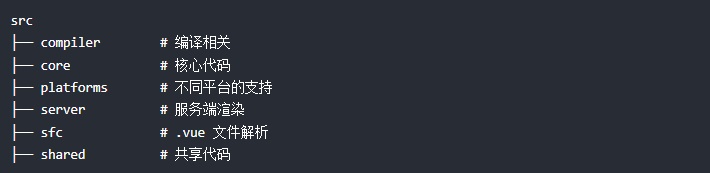

<!--
 * @Author: x09898 coder_xujie@163.com
 * @Date: 2022-08-16 17:30:03
 * @LastEditors: x09898 coder_xujie@163.com
 * @FilePath: \HTML-CSS-Javascript-\Vue框架\Vue的教程\Vue的源码分析.md
 * @Description: Vue的源码分析
-->
# Vue的源码分析

* Vue 内部使用 flow 来进行静态类型检验

## Vue的源码目录



1. compiler 目录包含 Vue.js 所有编译相关的代码。它包括把模板解析成 ast 语法树，ast 语法树优化，代码生成等功能。编译是一项比较耗时的工作
2. core 目录包含了 Vue.js 的核心代码，包括内置组件、全局 API 封装，Vue 实例化、观察者、虚拟 DOM、工具函数等等。重点学习的目录
3. Vue.js 是一个跨平台的 MVVM 框架，它可以跑在 web 上，也可以配合 weex 跑在 native 客户端上。platform 是 Vue.js 的入口，2 个目录代表 2 个主要入口，分别打包成运行在 web 上和 weex 上的 Vue.js。重点学习WEB打包后的 Vue 文件
4. Vue.js 2.0 支持了服务端渲染，所有服务端渲染相关的逻辑都在这个目录下。注意：这部分代码是跑在服务端的 Node.js，不要和跑在浏览器端的 Vue.js 混为一谈。服务端渲染主要的工作是把组件渲染为服务器端的 HTML 字符串，将它们直接发送到浏览器。
5. 通常我们开发 Vue.js 都会借助 webpack 构建， 然后通过 .vue 单文件来编写组件。sfc目录下的代码逻辑会把 .vue 文件内容解析成一个 JavaScript 的对象。
6. Vue.js 会定义一些工具方法，shared 定义的工具方法都是会被浏览器端的 Vue.js 和服务端的 Vue.js 所共享的

## Vue 中的实例方法

* 实例方法指的是挂载到 Vue 的 prototype 上
* 全局方法指的是挂在到 Vue(构造函数) 上

```js
function Vue() {
  ...
  // 这五个函数的作用就是向 Vue 的原型中挂载方法
  initMixin(Vue)
  stateMixin(Vue)
  eventsMixin(Vue)
  lifecycleMixin(Vue)
  renderMixin(Vue)
}
```

### initMixin

* 会向 Vue 的 protoType 中 添加 _init 方法，在 new Vue() 的时候，会执行这个方法。这个方法实现了一系列的初始化操作，包括生命周期和响应式系统流程的启动

### stateMixin

* vm.$watch()
* vm.$set()
* vm.$delete()

### eventsMixin

* vm.$on
* vm.$once
* vm.$off
* vm.$emit

### lifecycleMixin

* vm.$mount
* vm.$forceUpdate
* vm.$nextTick
* vm.$destroy

## Vue 中的全局 API

### Vue.extend()

* Vue.extend() 是 Vue 的基础构造器
* Vue.extend 的作用是创建一个子类，所以可以创建一个子类，然后让它继承 Vue 身上的一些功能。

```js
// 子类的原型，继承于父类的原型
// 这个子类之后就可以使用父类上的一些属性和方法
02  Sub.prototype = Object.create(Super.prototype)
03  Sub.prototype.constructor = Sub
04  Sub.cid = cid++
```

### Vue.component()

* 注册或获取全局组件

### Vue.nextTick()

### Vue.set()

### Vue.delete()

### Vue.directive

* 注册或获取全局指令

### Vue.filter()

* 注册或获取全局过滤器

### Vue.use()

* 安装 Vue.js 插件。如果插件是一个对象，必须提供 install 方法。如果插件是一个函数，它会被作为 install 方法。调用 install 方法时，会将 Vue 作为参数传入。install 方法被同一个插件多次调用时，插件也只会被安装一次

### Vue.mixin

* 安装Vue.js插件。如果插件是一个对象，必须提供install方法。如果插件是一个函数，它会被作为install方法。调用install方法时，会将Vue作为参数传入。install方法被同一个插件多次调用时，插件也只会被安装一次

### Vue.compile

* 编译模板字符串并返回包含渲染函数的对象

### Vue.version

* 编译模板字符串并返回包含渲染函数的对象

## 从源码角度来分析 Vue 的生命周期

* 分为四个阶段：初始化阶段、模板编译阶段、挂载阶段、卸载阶段

### 初始化阶段

* new Vue()到created之间的阶段叫作初始化阶段。这个阶段的主要目的是在Vue.js实例上初始化一些属性、事件以及响应式数据，如props、methods、data、computed、watch、provide和inject等。

```js
Vue.prototype._init = function (options) {
  initLifecycle(vm) // 初始化实例属性 以 $ 开头的属性是提供给用户使用的外部属性，以 _ 开头的属性是提供给内部使用的内部属性
  initEvents(vm)  // 初始化事件(事件而不是方法)
  initRender(vm)
  callHook(vm, 'beforeCreate')
  initInjections(vm) // 在 data/props 前初始化inject
  initState(vm) // 初始化状态(props, methods, data, computed, watch)
  initProvide(vm) // 在data/props后初始化provide
  callHook(vm, 'created')
  // 如果用户在实例化 Vue.js 时传递了 el 选项，则自动开启模板编译阶段与挂载阶段
  // 如果没有传递 el 选项，则不进入下一个生命周期流程
  // 用户需要执行 vm.$mount 方法，手动开启模板编译阶段与挂载阶段
  if (vm.$options.el) {
    vm.$mount(vm.$options.el)
  }

  // initLifecycle 初始化实例属性
  以 $ 开头的属性是提供给用户使用的外部属性，以 _ 开头的属性是提供给内部使用的内部属性
  vm.$parent 
  vm.$root 
  vm.$children
  vm.$refs
  vm._watcher
  vm._isDestroyed
  vm._isBeingDestroyed

  // initEvents 初始化事件
  初始化事件是指将父组件在模板中使用的 v-on 注册的事件(事件只是定义在组件上的事件，不会解析浏览器事件)添加到子组件的事件系统（Vue.js的事件系统）中。
  在这个阶段并不会处理模板中的浏览器事件，只有在渲染阶段才会处理模板中的浏览器事件

  // initInjections 初始化 inject(在 initState 之前获取 inject 数据，是为了能够在 data/props 中使用 inject 得到的数据) 
  // initProvide 初始化 provide
  provide 和 inject 主要为高阶插件/组件库提供用例，并不推荐直接用于程序代码中
  可用的注入内容指的是祖先组件通过 provide 注入了内容，子孙组件可以通过 inject 获取祖先组件注入的内容。

  // initState 初始化状态
  初始化的顺序为 props (放在前面保证data，methods,computed中可以使用 props), methods, data, computed, watch(放在最后保证 watcher 可以监听前面的数据)
  
  1.props

  调用 camelize 函数将 props 名称驼峰化，即可以将 a-b 这样的名称转换成 aB。
  <child user-name="data"></child>
  props: ['userName']

  2.methods
  初始化methods时，只需要循环选项中的methods对象(会判断一下不能和 props 同名)，并将每个属性依次挂载到vm上即可(通过 vm[x] 来访问定义的 x 方法)

  3.data
  data 中的数据最终会保存到 vm._data 中。然后在 vm 上设置一个代理，使得通过 vm.x 可以访问到 vm._data 中的 x 属性

  4.computed
  计算属性通过 watcher 来实现缓存和收集依赖的功能

  5.watcher

```

### 模板编译阶段

* created 钩子函数与 beforeMount 钩子函数之间的阶段是模板编译阶段。这个阶段的主要目的是将模板编译为渲染函数，只存在于完整版中。如果在只包含运行时的构建版本中执行 new Vue()，则不会存在这个阶段

### 挂载阶段

* beforeMount 钩子函数到 mounted 钩子函数之间是挂载阶段。在这个阶段，Vue.js 会将其实例挂载到 DOM 元素上，通俗地讲，就是将模板渲染到指定的 DOM 元素中。
* 在挂载的过程中，Vue.js 会开启 Watcher 来持续追踪依赖的变化。在已挂载状态下，Vue.js 仍会持续追踪状态的变化。当数据（状态）发生变化时，Watcher 会通知虚拟 DOM 重新渲染视图，并且会在渲染视图前触发 beforeUpdate 钩子函数，渲染完毕后触发 updated 钩子函数。
* 通常，在运行时的大部分时间下，Vue.js 处于已挂载状态，每当状态发生变化时，Vue.js 都会通知组件使用虚拟 DOM重新渲染，也就是我们常说的响应式。这个状态会持续到组件被销毁。

### 卸载阶段

* 应用调用 vm.$destroy 方法后，Vue.js 的生命周期会进入卸载阶段。在这个阶段，Vue.js 会将自身从父组件中删除，取消实例上所有依赖的追踪并且移除所有的事件监听器。
