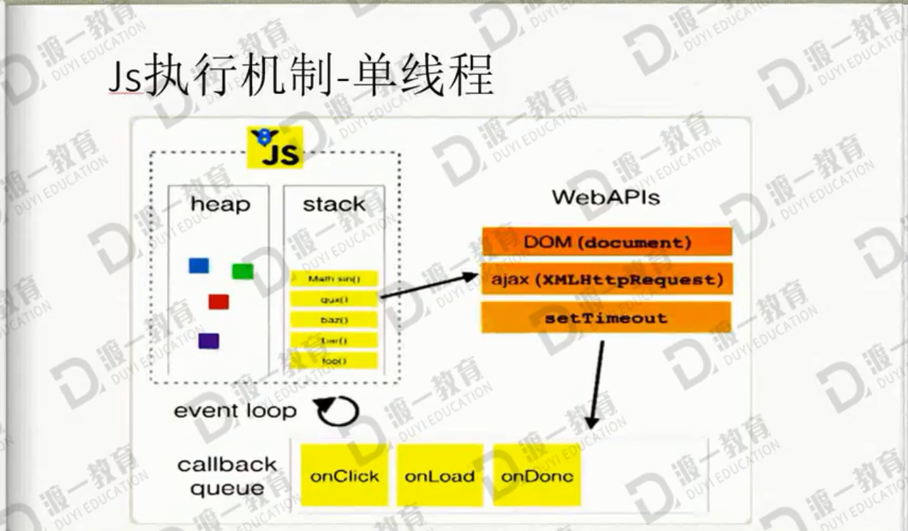

# js执行机制详解

## 浏览器常驻的线程

    - js引擎线程 (解释执行js代码，用户输入，网络请求)
    - GUI线程，(绘制用户界面，与js的主线程是互斥的)
    - http网络请求线程(处理用户的get，post等请求，等返回结果后将回调函数推入任务队列)
    - 定时器触发线程，(setTimeout，setInterval等待时间结束后把执行函数推入任务队列中)
    - 浏览器时间处理线程(click，mouse等交互事件发生后将这些事件放入事件队列中)

## js执行机制

    单线程执行。 是基于单线运行的，同时又是异步执行的。是根据事件来驱动的。

### 命令用于查看执行栈

    debugger;

## 同步任务

    1. 代码没有执行的时候，创建了一帧，这帧中包含了形参，局部变量，(预编译过程),然后把这一帧压入栈中。
    2. 然后执行foo函数内代码，执行bar函数
    3. 创建新帧，同样有形参，局部变量，压入栈中。
    4. bar函数执行完毕，弹出栈。
    5. foo函数执行完毕，弹出栈。
    6. 执行栈为空
    执行栈相当于js主线程

## 重新理解定时器

    setTimeout的等待时间结束后并不是直接执行的，而是先推入浏览器的一个任务队列，在同步队列结束后再依次调动任务队列中的任务。
    setTimeout的时间间隔无论如何达不到0毫秒，html标准，最低四毫秒。
    setInterval是每隔一段时间把任务方法到事件队列中
