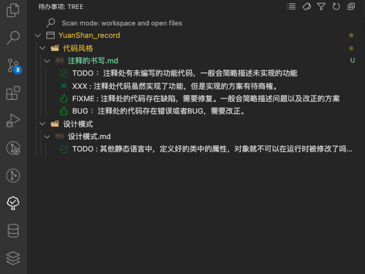
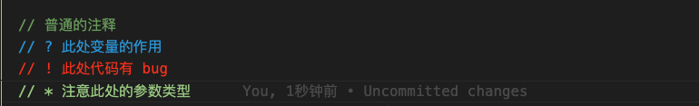

# 注释的书写

## 一、单行注释的书写

- 单行注释符与注释内容需要保留一个空格

```js
//bad comments
// good comments
```

- 单行注释最好写在代码的上面而不是右边

```js
// good comments
let add = "xxx"
let add = "xxx"   // bad comments
```

## 二、多行注释

- 多行注释的 `*` 号对齐，并且注释的内容不要写在起始符号 `/**` 和结束符号 `*/` 所在行

```js
/* matches from matchExpr["CHILD"]
1 type (only|nth|...)
2 what (child|of-type)
*/

/**
 * matches from matchExpr["CHILD"]
 * 1 type (only|nth|...)
 * 2 what (child|of-type)
 */
```

## 三、注释的前缀

- 注释中的专有名词，每种名词用来表明一种状态
- 可以配合 ToDo Tree 插件进行使用，Vscode 的左侧栏会出现一个新的标签
- 可以在 HTML CSS JS 文件中使用
- 只适用于 `//` 单行注释中
- 插件支持自定义标签



```js
// NOTE: 表示指的强调和注意的地方，特别是代码编写者的想法，意图和灵感(能表现的意思很灵活)
// TODO：注释处有未编写的功能代码，一般会简略描述未实现的功能
// XXX: 注释处代码虽然实现了功能，但是实现的方案有待商榷。
// FIXME: 注释处的代码存在缺陷，需要修复。一般会简略描述问题以及改正的方案
// BUG：注释处的代码存在错误或者BUG，需要改正。
```

## 四、Better Comments

- Better Comments 不同的符号会有不同的颜色进行区分
- 可以在 CSS JS 文件中使用, HTML 文件中不起作用
- 适用于多行注释以及单行注释
- 插件支持自定义符号


