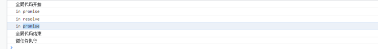

# JavaScript 事件循环机制

TODO: 学习相关知识(时间循环、Promise、async await)之后，完善这一块的文档
TODO: 对 node 的拓展，node 因为时间循环机制而存在的优势，和劣势

## 一， 事件循环机制

### 同步任务和异步任务

**同步任务**：如果在函数A返回的时候，调用者就能够得到预期结果(即拿到了预期的返回值或者看到了预期的效果)，那么这个函数就是同步的。
**异步任务**：如果在函数A返回的时候，调用者还不能够得到预期结果，而是需要在将来通过一定的手段得到，那么这个函数就是异步的。

### 浏览器页面中的线程

**主线程：**JS 引擎线程，负责处理Javascript脚本程序。
**GUI线程**：在浏览器渲染和重绘界面时执行，GUI渲染线程和JS线程是互斥的。(JS代码加载阻塞原因)
**工作线程：**浏览器的事件处理线程，定时器触发线程，HTTP请求线程

### 消息队列和事件循环机制

工作线程将消息放到消息队列，主线程通过事件循环过程去取消息。
**消息队列**：消息队列是一个先进先出的队列，它里面存放着各种消息。
**事件循环**：事件循环是指主线程重复从消息队列中取消息、执行的过程。
主线程只会做一件事情，就是从消息队列里面取消息、执行消息，再取消息、再执行。当消息队列为空时，就会等待直到消息队列变成非空。而且主线程只有在将当前的消息执行完成后，才会去取下一个消息。这种机制就叫做事件循环机制，取一个消息并执行的过程叫做一次循环。

### 由现象发现问题

由于对于消息队列的事件循环机制的了解不彻底

#### 异步任务注册函数和异步任务回调函数

从异步过程的角度看，addEventListener 函数就是异步过程的发起函数，事件监听器函数就是异步过程的回调函数。事件触发时，表示异步任务完成，会将事件监听器函数封装成一条消息放到消息队列中，等待主线程执行。
**定时器任务中：**setTimeOut(() => {...},1000)** **setTimeOut函数是异步的发起函数，1000毫秒时间到了表示异步任务完成。定时器线程将 () => {...}回调函数放到消息队列中。等待主线程执行。
**网络请求中：**new Promise()是异步的发起函数，resolve()或者reject()执行代表异步任务完成，网络请求线程会将then() catch()的回调函数放入消息队列中，等待主线程的执行。
消息队列中消息的**添加**和**监测行为**是独立于事件循环的(消息的添加应该是由对应的工作线程完成， 网络工作线程， 事件线程， 定时器线程)(例如一个1000的定时器，不是碰到定时器语句就给直接扔到宏任务队列里面了，而是由定时器线程监测这个定时器，等到1000毫秒之后，会把定时器中的回调函数放入宏任务中。因为是定时器线程进行的监测，JS执行线程并没有被占用，所以定时器下面的JS语句会被紧接着执行)
**消息队列中放置的是异步任务的回调函数，而不是异步任务注册函数。**

#### 消息队列的进阶

**宏任务：**(定义为独立的工作单元)全局的JS代码，定时器任务，鼠标事件，键盘事件
**微任务：**（更小的任务） Promise.then（） Promise.catch（）Vue中的nextTick
一次事件循环最多处理一次宏任务， 然后会处理微任务队列中的所有任务， 然后检查UI是否需要重新渲染。
在宏任务基础上添加微任务队列的好处：添加微任务的好处就是能够让浏览器及时的处理宏任务中进行的DOM改动，假设没有微任务队列，如果浏览器中一次性添加了10个宏任务，这些宏任务中执行的对于DOM的操作都要等到10个宏任务全部执行完之后才能进行页面的更新，页面会显得十分卡顿，添加了微任务队列之后就可以使得宏任务对DOM进行改动之后，及时的在微任务中进行更新而不用等待所有宏任务都执行完成

#### 事件循环执行顺序

1. 一开始全局JavaScript代码作为第一个宏任务执行
2. 执行过程中同步代码直接执行，宏任务进入宏任务队列，微任务进入微任务队列
3. 当前宏任务执行完之后弹出事件队列，检查微任务列表，有则直接执行完
4. 然后检查宏任务队列中的下一个宏任务，然后回到3，直到宏任务和微任务全都执行为空。

代码定义

执行结果

## 二，Promise的使用

New Promise () 中的代码都是同步执行的
Promise.then（）方法才是异步任务(微任务)。

## 三，async和 await

**async:**async只是一个标识符，如果不搭配 await 的话，使用 async 的函数和普通函数没有什么本质区别。在没有 await 的情况下，async 函数会立刻执行，将 async 函数的返回值包装成一个 Promise 对象，并且不会阻塞后面的语句。
**await**: 理解为 await 后面的语句相当于放到了 **new Promise **中， 下一行及之后的语句相当于放在了**Promise.then**中。await 只能在 async 的函数中使用, await 才是造成阻塞的实质

### Await 后面跟 Promise 类型值和非 Promise 类型值

1. await 后面跟上 Promise 实例

浏览器中的输出信息符合我们的预期，await后面的语句等到异步任务有了结果才执行(两秒钟后执行)，await下一行及下一行之后的语句相当于放到了Promise的then方法中。

2. await后面跟着的是一个定时器

浏览器输出的日志是立刻打印“同步代码”和 1(定时器的返回值)。两秒钟之后打印定时器执行。代码的执行并没有按照我们预想的顺序执行。Await 并没有造成阻塞。

3. await后面跟着同步的表达式

浏览器立刻打印 “同步代码”和2。

## 四，连续调用异步请求

### 使用回调函数的方式进行连续的异步请求

每一次后续的请求都要加深一层函数的嵌套，如果加上业务处理逻辑的话，代码会显得很难阅读，这种现象也被称为回调地狱。

### 使用Promise的方式进行连续的异步调用

通过Promise的特性，可以从函数嵌套的方式转变为链式调用的方式

### 使用 async 和 await 实现连续的异步调用

可以使用书写同步代码的形式来实现异步代码的执行

### 最终的实现效果

以上三种方式实现的效果是一样的。代码执行之后，两秒钟之后打印浙江，在两秒钟之后打印浙江杭州，再过两秒钟只有打印浙江杭州滨江

