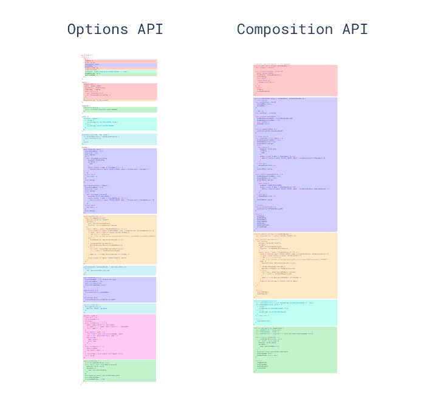

# Vue3 和 Vue2 对比

TODO：不要网上千篇一律的内容，需要结合上自己平时的开发体验

## 一，响应式原理

### Vue2

- Vue2 使用 `Object.defineProperty` 来拦截对象属性的改变

#### Vue2 响应式缺点

1. 只有在一开始就存在 data 中的数据才是响应式的
2. 无法响应式的为对象添加属性( Vue2 提供 `Vue.set(object, 'key', 'value')` 来解决缺陷)

### Vue3

- Vue3 使用 proxy 来对整个对象进行代理

#### 优点

1. 性能上更加优秀，因为代理的是整个对象。不需要递归的给每个响应式属性都添加一个 Observer 类
2. 直接对整个对象进行劫持，不需要做额外的考虑(相比于 Vue2 来说)

#### 缺点

1. 不支持 IE 浏览器(因为 babel 无法转换 Proxy)
2. 如果使用`组合式API`的写法，需要注意的地方比较多。使用 reactive 时解构可能会丢失响应式

## 二，书写方式的对比

### Vue2 代码

- 仅支持选项式编写代码

### Vue3 代码

- 同时支持选项式 API 和 组合式 API

#### 组合式 API 的特点

- 代码的写法更加简洁，同一个逻辑关注点相关的代码被归为了一组：我们无需再为了一个逻辑关注点在不同的选项块间来回滚动切换

- 可以方便的将一组代码移动到一个外部文件中(组合函数的形式，不依赖 this)，能够实现更加简洁高效的逻辑复用。不在需要为了抽象而重新组织代码，降低了重构的成本。
- 可以更好的支持类型推导(TS)
- 选项式 API 将开发者锁定在规定的代码组织模式中，组合式 API 允许开发者在编写代码时运用上 javaScript 代码组织的最佳实践

## 三， Vue3 的浏览器兼容性

### PC 端

1. Chrome：51 – 113
2. Edge：15 – 110
3. Safari：10 – 16.3 – TP
4. Firefox：54 – 112
5. Opera：38 – 94
6. IE：`不支持`

### 移动端

1. Chrome for Android：109；
2. Safari on iOS：10 – 16.3；
3. Samsung Internet：5 – 19.0；
4. Opera Mobile：73；
5. UC Browser for Android：13.4；
6. Android Browser：109；
7. Firefox for Android：109；
8. QQ Browser：13.1；
9. Baidu Browser：13.18；

## 四，Mixin 和 组合式函数的对比

- 在 Vue3 中不推荐使用 Mixin 进行代码的逻辑复用，推荐使用组合式函数来代替 Mixin(组合式函数中可以使用 Vue 的所有 API)，组合式函数 + Ref + 解构的模式可以解决 Mixin 的所有问题

### Mixin 的缺点

1. 不清晰的数据来源：使用多个 Mixin 时，实例上的数据来自哪里变得不清晰。
2. 命名空间冲突: 多个 Mixin 会造成命名冲突
3. 隐式的 Mixin 交流：多个 Mixin 依赖相同属性时，会使得它们隐形的耦合在一起(并没有显式的使用参数)

## 五，其他

1. Vue3 支持碎片，一个组件可以拥有多个根节点(能有效地减少很多无用的 div)
2. Vue3 的设计模式给予开发者`按需引入`API 的能力。可以减少不必要的引用导致性能或者体积问题、
3. Vue3 将声明周期 beforeCreate() created() 合并为 setup(), 开发者在 setup() 函数中编写代码并且注册其他的声明周期函数
4. V-if 和 v-for 的优先级不同
5. diff 算法优化，性能更好
