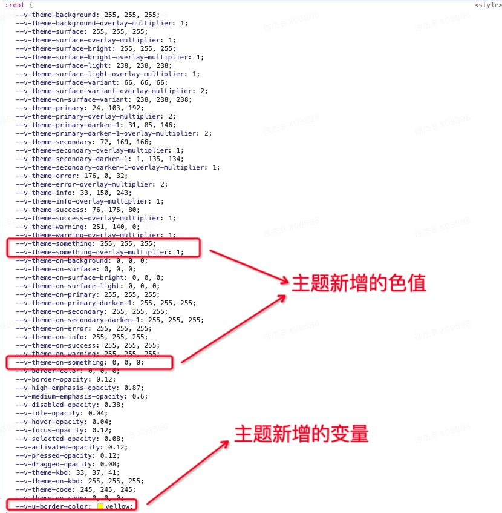

# Vuetify 组件库试用

* Github Star 38.8k
* 采用 Google 推出的 Material Design 设计语言

## 一、布局

* Vuetify 提供了一个应用布局系统以便于轻松创建复杂的网站设计

1. v-app-bar 一个放置导航组件、品牌展示、搜索栏和操作按钮的容器
2. v-system-bar 取代原生手机系统栏的系统栏
3. v-navigation-drawer 一个持有站点导航链接的持久性或临时性的容器
4. v-footer 一个替换默认的 html 页脚的通用组件
5. v-bottom-navigation 一个具有导航链接且通常用于较小设备的持久性或临时性的容器
  
```html
<!-- App.vue -->
<!-- v-app 是整个 Vuetify 组件的挂载点，全局只能有一个 -->
<v-app>
  <!-- 取代原生手机系统栏 -->
  <v-system-bar class="d-flex justify-center"> Vuetify 组件演示 </v-system-bar>
  <!-- 在 v-main 中放置页面内容 -->
  <v-main>
    <router-view />
  </v-main>
</v-app>
```

### 路由的自动注册

* TODO: 需要去了解实现

## 二、全局配置

* Vuetify 允许您在设置应用程序时全局或每个组件设置默认 prop 值

```ts
// plugins/vuetify.js
import { createVuetify } from 'vuetify'
import { VBtn } from 'vuetify/components';

// 导出 vuetify 实例
export default createVuetify({
  // 使用别名，在原组件的基础上派发出新的组件
  aliases: {
    VBtnSecondary: VBtn,
    VBtnTertiary: VBtn,
  },
  defaults: {
    // 为组件自定义 prop
    VBtn: {
      color: '#f3f4f7'
    },
    // 定义的新组件可以直接在项目中使用
    VBtnSecondary: {
      color: 'secondary',
      variant: 'flat',
    },
    VBtnTertiary: {
      rounded: true,
      variant: 'plain',
    },
    // 禁用所有组件的波纹
    global: {
      ripple: false,
    },
    // 定义嵌套在 card 中的 btn 组件 variant 属性
    VCard: {
      VBtn: { variant: 'outlined' },
    },
  },
})
```

* 默认提供程序允许您为应用程序的某个部分中的组件提供特定的默认 prop 值
  
```ts
// xxx-xxx.vue
// defaults 属性与 createVuetify 的 defaults 一致(也可以使用全局定义的别名)
<v-defaults-provider
  :defaults="{'VBtn':{'color':'primary','size':'large','variant':'tonal'}}"
>
  <v-btn>Button</v-btn>
</v-defaults-provider>
```

## 二、组件内 SASS 变量

* Vuetify 使用 SASS/SCSS 来设计框架所有方面的样式和外观，每个组件都对外暴露了 scss 变量(文档中可查)，通过对 SCSS 变量的覆盖即可达到全局的样式覆盖效果

```scss
// 修改当前文件后，需要重新编译项目后才会生效
// NOTE: 有些属性可以在多个地方进行配置，权重关系如下
// 权重关系：settings.scss < 组件内 < vuetify.ts > 组件内 + ！important
@use 'vuetify/settings' with (
  // btn
  $button-height: 40px,
  $button-banner-actions-padding: 16px,
);
```

## 三、样式和动画

### 3.1 CSS reset

* 不同的浏览会为 DOM 元素注入不同的样式(各浏览器的标准不尽相同)，CSS 重置就是为了消除这些差异
* Vuetify 内置 CSS reset, 可以在 settings.scss 文件中通过 `$reset: false` 来禁用
  
> 应用 box-sizing: border-box 到所有元素.
> 重置所有元素的 padding 和 margin .
> 在所有元素和为元素中指定 background-repeat: no-repeat .
> 继承 text-decoration 和 vertical-align 到 ::before 和 ::after.
> 在所有的浏览器中移除悬停时的 outline .
> 指定code元素的字体为 font-family: monospace .
> 重置input元素的 border-radius .
> 指定表单元素的字体继承。
> 移除所有浏览器中的默认按钮样式。
> 指定文本区域的大小调整为垂直。
> 应用 cursor: pointer 到按钮元素.
> 在 html 中应用 tab-size: 4 .
> 像标准input一样的 select 样式.
> 由aria属性设置 cursor 样式.
> 隐藏屏幕上的内容，但不隐藏屏幕阅读器。

### 3.2 动画

* 当前的 H5 项目确实在动画方面存在一定的短板，页面的操作显得生硬不流畅

TODO： Vue 路由切换级别的动画效果实现


### 3.3 调色板

* 开发者可以直接访问 Vuetify 提供的 颜色值，并通过 scss 和 JS，这些值可以在样式表、组件、color 属性上使用

```html
// 语法格式为：{color}-{lighten|darken}-{n}
<v-btn color="red-lighten-3">
  no One
</v-btn>
```

* 规范中的每种颜色都会转换为背景和文本变体，以便通过`类`在应用程序中进行样式设置

```scss
// text语法格式： text-{color}-{lighten|darken}-{n}
// 背景色语法格式：bg-{color}-{lighten|darken}-{n}
<v-btn class="text-red-lighten-3 bg-grey-lighten-3">
  no One
</v-btn>
```

### 3.4 工具类

* Vuetify 将常用的 CSS 样式(阴影、颜色、间距、flex)集合都封装成了 CSS 类名，我们仅需要添加类名便能得到对应的样式，很少需要手动去写 CSS 样式代码
* 通过 js 执行操作 CSS 样式会比较繁琐，在 Vuetify 中可以直接用 JS 来操作类名(操作类名较简单)，来实现改变样式的效果
* TODO: 带来的问题是，CSS 的类名要去哪里查询？是否有插件的支持
* 和传统 css 开发形式的好处：1. 项目能达到统一的样式风格 2. 用 vuetify 提供的类名能够更好的实现响应式开发(配合断点去使用)

1. border-radius 辅助类 详见：工具类 - 边距圆角

2. 显示辅助类
   .d-{value} 用于 xs, value: none inline inline-block block table table-cell table-row flex inline-flex
   .d-{breakpoint}-{value} for sm, md, lg, xl, and xxl

| 屏幕大小            |       类名                  |
| :--------------    | :--------------------   |
| 全部隐藏            |     .d-none                |
| 仅在 xs 大小时隐藏   |     .d-none .d-sm-flex     |
| 仅在 sm 大小时隐藏   |     .d-sm-none .d-md-flex  |
| 全部可见            |     .d-flex                |
| 仅在 xs 大小时可见   |     .d-flex .d-sm-none      |
| 仅在 sm 大小时可见   |.d-none .d-sm-flex .d-md-none|

3. 阴影辅助类
  .elevation - {n} 0~24 n 越大，阴影明显 详见：工具类 - 阴影

4. 弹性布局辅助类

| flex 辅助类         |       编译结果              |
| :--------------  | :----------------------   |
| .d-flex            |     display: flex !important;    |
| .flex-fill         |     flex: 1 1 auto !important;    |
| .flex-0-1-100(好像只有 100 才生效，其他值不可以)     |     flex: 0 1 100% !important;  |
| .flex-row            |     flex-direction: row !important               |
| .justify-center   |     justify-content: center !important      |
| 以上的所有类名均可以加上断点使用   |  ....      |

5. 尺寸工具类

* 感觉这个并不全面，只能使用百分值， UnoCSS 等插件都是可以使用 `w-10px` 这种形式的，更加灵活方便

```scss
.{prefix}-{size}
prefix: h(高) w(宽) 
size: auto screen 0 25 50 75 100 // screen 仅高度可用， 数字对应的是百分比
```

6. 间距工具类，文本和排版工具类(详尽去看文档)

```scss
间距工具类格式：.{property}{direction}-{breakpoint}-{size}
文本工具类格式：.text-{breakpoint}-{value}
```

## 四、响应式布局

* 栅格系统、显示辅助类、断点
* Vuetify 还在 JS 层面提供了当前设备的类型，拥有 JS 代码的响应式适配(eg: 按钮点击后 pc 需要弹窗再次确认，移动端则直接进行操作)
* 裁定断点，在不同的断点内应用不同的样式
* 移动优先(xs 可忽略)： .text-xs-h1 除了手机外，还能向上影响其他的断点，.text-md-h1 笔记本、桌面端、超大屏

```scss
> 1904px        超大屏 xl
1264px><1904px  桌面端 lg
960px><1264px   笔记本 md
600px><960px    平板 sm
<600px          手机 xs
```

## 五、主题

### 主题的切换

* Vuetify 预装了两个主题 `dark` `light`, 可

```ts
// 1. 配置默认主题
// vuetify.ts
export default createVuetify({
  theme: {
    defaultTheme: 'dark'
  }
})

// 2. 可以在运行时通过 JS 逻辑来更换主题
<script lang="ts" setup>
// 使用 Theme 相关 API
import { useTheme } from 'vuetify'
const theme = useTheme()

// 点击按钮进行主题的切换
function toggleTheme () {
  theme.global.name.value = theme.global.current.value.dark ? 'light' : 'dark'
}
</script>
```

### 自定义主题

* Vuetify 支持用户自定义主题

#### 定义主题的内容

```ts
// 1. 自定义主题
// vuetify.ts
import { createApp } from 'vue'
import { createVuetify, type ThemeDefinition  } from 'vuetify'
const myCustomLightTheme: ThemeDefinition = {
  dark: false,
  colors: {
    background: '#FFFFFF',
    surface: '#FFFFFF',
    'surface-bright': '#FFFFFF',
    'surface-light': '#EEEEEE',
    'surface-variant': '#424242',
    'on-surface-variant': '#EEEEEE',
    primary: '#1867C0',
    'primary-darken-1': '#1F5592',
    secondary: '#48A9A6',
    'secondary-darken-1': '#018786',
    error: '#B00020',
    info: '#2196F3',
    success: '#4CAF50',
    warning: '#FB8C00',
    something: '#00ff00' // 自定义的一个颜色
  },
  variables: { // 自定义的变量
    'border-color': '#000000',
    'border-opacity': 0.12,
  }
}
export default createVuetify({
  theme: {
    defaultTheme: 'myCustomLightTheme',
    themes: {
      myCustomLightTheme,
    },
  },
})
```

#### 使用主题的内容

1. background、surface、primary 等是 Vuetify 内置的色值
2. something 是用户自定义的色值，Vuetify 将生成许多 `CSS` 类和变量供你在应用程序中使用

```html
<!-- 在 HTML 中使用 -->
<div class="bg-something g">background color</div>
<div class="text-something">text color</div>
<div class="border-something">border color</div>
<!-- 在 CSS 中使用, 前缀是 --v-theme- -->
.btn {
  background-color: rgb(var(--v-theme-something));
}
```

3. border-color、border-opacity 是用户自定义的变量

```css
.btn {
  border: 5px solid var(--v-border-color);
}
```



### 局部主题

* Vuetify 支持一个应用程序中同时存在多种主题

```html
<!-- 1. 大部分组件都支持 theme prop, 并且该主题会影响自身以及所有子组件 -->
<v-card theme="dark">
  <!-- button uses dark theme -->
  <v-btn>foo</v-btn>
</v-card>

<!-- 2. 为应用程序的大块部分设置主题 -->
<v-theme-provider theme="high-contrast">
  <!-- uses the high-contrast theme -->
  <v-card>...</v-card>
  <v-btn>...</v-btn>
</v-theme-provider>
```

## 五、vscode 适配

* vuetify-vscode 插件: 效果未知

## 六、tree-shaking

* tree-shaking：移除 JavaScript 上下文中的未引用代码 (dead-code)
* 依赖于 ES2015 的模块语法. 模块的导入（import）和导出（export）语句必须是静态的，也就是说，导入和导出的内容在编译时就能确定，而不是在运行时。这样工具链才能分析出哪些模块或哪些导出是实际被使用的。
* Vuetify 自动支持 tree-shaking 而无需手动导入
