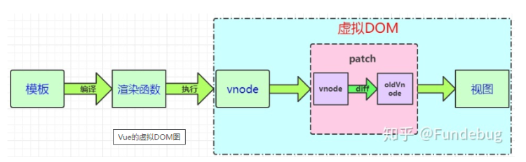
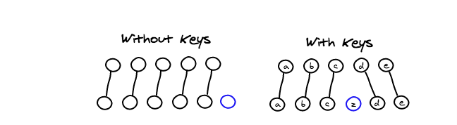

# Vue 的页面渲染

## 一、Vue 中的相关概念



1. 状态：就是开发者定义和操作的数据(数组，对象，字符串，数字等等)
2. 模板：`<template>`  标签之间的内容。我们使用模板来描述状态与 DOM 之间的映射关系
3. 渲染函数：vue 通过编译将 template 模板转换为渲染函数(rander)，执行渲染函数就能够得到 Virtual DOM。如果编码过程中不写 template 而是直接写 rander 函数能够得到更高的性能。
   TODO: rander 在什么层面不会受到同等的优化来着？
4. Virtual: 虚拟 DOM 结点，本质上就是 JS 对象，对象描述了应该怎样去创建真实的 DOM 结点。

```js
const virtualObj = {
  tag: "div",
  class: "content",
  children: [{ tag: "span", class: "item", text: "hello word!" }],
};
```

5. patch 算法：最终目的是将 Virtual DOM 渲染成真实的 DOM。但是 patch 算法中还使用了 diff 算法(渲染过程中的一种优化方案)。使得 Vue 可以不必暴力绘制全部的 DOM 结点。而是对比新旧结点的不同。仅仅对需要更新的 DOM 结点进行更新。

## 二、视图层框架的范式

### 2.1 命令式范式

- JQ 是典型的命令式框架, 命令式框架`关注过程`

```text
01 - 获取 id 为 app 的 div 标签
02 - 它的文本内容为 hello world
03 - 为其绑定点击事件
04 - 当点击时弹出提示：ok
```

- 翻译成对应的代码，自然语言能够和代码产生`一一对应`的关系

```js
01 $('#app') // 获取 div
02   .text('hello world') // 设置文本内容
03   .on('click', () => { alert('ok') }) // 绑定点击事件
```

### 2.2 声明式范式

- Vue 是典型的声明式框架，声明式框架关注`结果`。实现该结果的过程由 Vue 完成

```js
01 <div @click="() => alert('ok')">{{ text }}</div>
const text = ref('hello world')
```

### 2.3 不同范式下更新内容

1. 命令式：`div.textContent = 'no One'`
2. Vue 会通过前后内容的对比得到本次更新的`差异`，并且只更新变化的内容 `div.textContent = 'no One'`

> 声明式代码的性能不优于命令式代码的性能

- 假设直接修改的性能消耗为 A，找出差异的性能消耗为 B

1. 命令式更新的性能消耗：A
2. 声明式更新的性能消耗：B + A

- 声明式代码更新的性能`理论上`不会好于命令式代码更新(`此处的命令式代码更新指的是极致优化的情况下`)，因为声明式会`多一次查找差异`的过程。

### 2.4 操作 DOM 的代码是昂贵的!

操作对象:

```js
const app = [];
console.time("操作对象");
for (let index = 0; index < 10000; index++) {
  const div = { tag: "div", class: "child" };
  app.push(div);
}
console.timeEnd("操作对象");

// 操作对象: 0.265869140625 ms
```

操作 DOM:

```js
const app = document.querySelector("#app");
console.time("操作DOM");
for (let index = 0; index < 10000; index++) {
  const div = document.createElement("div");
  div.setAttribute("class", "child");
  app.appendChild(div);
}
console.timeEnd("操作DOM");

// 操作DOM: 6.808837890625 ms
```

结论：`操作 DOM 的代码是昂贵的!`, 操作 JS 与操作 DOM 差了 25 倍

假设场景: 一个列表数组中有 100 条数据，在进行一次操作之后需要删除数组前 10 条数据，末尾添加 10 条数据。

`操作原生DOM(没有优化手段)`: 直接将最新的 100 条数据进行循环渲染。
耗费性能: 删除 100 个 DOM，添加 100 个 DOM
编码难易: 虽然需要操作 DOM，但是操作手段简单粗暴。不需要考虑 DOM 的变化点

`借用虚拟DOM`: 先查找差异，再针对变化的部分进行渲染
耗费性能: 删除 10 个 DOM, 添加 10 个 DOM， 加上寻找差异的时间
编码难易: 声明式的代码，不需要操作 DOM，编码简单，程序有可维护性

`操作原生DOM(极致优化):` 开发者要明确 DOM 的变化。手动对需要变动的地执行方 DOM 操作
耗费性能: 删除 10 个 DOM, 添加 10 个 DOM
编码难易: 需要明确 DOM 的变化点, 需要手动进行大量 DOM 操作。程序可维护性差。

### 2.6 结论

- 命令式代码(极致优化下)：性能最好、但是难以维护、开发效率低(手动实现创建、更新、删除等工作)
- 声明式代码： 容易维护、开发效率高、相对不错的性能(Vue 框架借用虚拟 DOM + diff 来实现声明式，虚拟 DOM 不是一项功能，而是一种达到目的的手段)
- 权衡的艺术 - 在真实的业务场景中 DOM 是更加复杂的树形结构(不仅 DOM 节点是树形的，节点下的属性也是树形的)。大部分情况下，开发者`很难写出绝对优化的命令式代码(需要学习高效操作 DOM 的知识、需要明确 DOM 的变化点)`。即使写出了极致优化的代码也一定会耗费巨大精力，投入产出比并不高。借用虚拟 DOM + diff 来更新页面，能保证开发者既能享受到声明式代码的便利之处和可维护性，又能得到一个相对不错的性能。

## 三、运行时和编译时

### 3.1 编译时

- 编译时是指在代码实际执行之前，框架对源码进行解析、转化、优化的过程。这个过程通常发生在构建阶段或者应用初始化过程中
- 前端框架 Svelte 是编译时框架， 会将你的代码编译成体积小，不依赖框架的普通 JS 代码

```js
TODO: Svelte 框架还没有使用过，目前还没有使用 Svelte 作为代码示例
// 定义模版
<div>
  <span> { text } <span>
</div>
let text = '编译时'

// 编译结果
const div = document.createElement('div')
const span = document.createElement('span')
span.innerText = '编译时'
div.appendChild(span)
document.body.appendChild(div)
```

#### 编译时-优缺点

1. 性能优化：大部分工作在构建阶段完成。运行时的开销较小，有助于提升运行时性能、首屏渲染速度较快、可以在编译过程中自定义优化方案
2. 灵活性受限：静态生成的内容缺乏动态交互能力

### 3.2 运行时

- 运行时是指代码实际执行时的阶段

```js
// 数据对象
const obj = {
  tag: "div",
  children: [{ tag: "span", children: "运行时" }],
};

// Render 函数
function Render(obj, root) {
  const el = document.createElement(obj.tag);
  if (typeof obj.children === "string") {
    const text = document.createTextNode(obj.children);
    el.appendChild(text);
  } else if (obj.children) {
    // 数组，递归调用 Render，使用 el 作为 root 参数
    obj.children.forEach((child) => Render(child, el));
  }

  // 将元素添加到 root
  root.appendChild(el);
}

// 开发者使用过程
Render(obj, document.body);
```

#### 运行时-优缺点

1. 免除了编译代码的过程
2. 可以在运行过程中加入响应式系统、动态事件处理、组件生命周期等框架内置的功能
3. 提供的数据对象形式较抽象，不如模板的写法更简洁

### 3.3 运行时 + 编译时

- Vue 采用的是运行时 + 编译时
- 用户可以使用 template 来编写代码， template 会被编译成 Render 函数， Render 函数在运行时执行

## 四、Diff 算法

TODO：根据书籍来完善文档

1. diff 算法用来比较两个 Virtual DOM 树的差异，diff 算法只会比较同一个层级的元素。diff 算法不会跨层级比较。因为跨层级改变 DOM 的情况很少(能够有效减少 diff 算法的时间复杂度)
2. diff 算法在同层级比较结点时，例如在比较第二层的 div 时，发现新旧虚拟结点有不同，不会再进行 div 下一层的比较而是直接将第二层结点整个更新(即使第三层的子节点有相同的结点也不再复用
3. 采用深度优先算法

## 四，Vue 中的 key 值

> 当 Vue 正在更新使用 `v-for` 渲染的元素列表时，它默认使用“就地更新”策略。如果数据项的顺序被改变，Vue 将不会移动 DOM 元素来匹配数据项的顺序，而是就地更新每个元素，并且确保它们在每个索引位置正确渲染。这个类似 Vue 1.x 的 `track-by="$index"`

`触发时机`: Vue 会使用一种最大限度减少动态元素并且尽可能的尝试修复/再利用相同类型元素的算法。 Vue 在进行 VNode 对比时会看两个东西: tag 和 key。如果这两个东西都相同则会复用 DOM 结构，只更新其中的数据
`适用场景`: 单纯的展示列表数据(具有分页功能)。在切换页面时由于都是相同的结构，所以并不存在 DOM 元素的删除与创建。只需要更新其中的数据

Vue 列表的 key 值

适用场景:

1. 列表数据会被打乱顺序（如上图）
2. 具有相同 DOM 结构的组件相互切换(加入 key 值之后，input 中的数据不会复用，会触发这两个组件完整的生命周期，说明真的进行了销毁和重建这个过程)(eg: 登录/注册表单的切换)

TODO： 想要强制页面刷新的时候，可以通过更改 key 值来实现

## 五，Vue 的 nextTick

5.1 `官网解释:` this.$nextTick(() => {}) 将回调函数延迟到下次 DOM 更新周期之后执行。在修改数据之后立即使用它，然后等待 DOM 更新。
5.2 `出现原因:` Vue 在修改状态之后，DOM 不会立刻同步更新(采用异步更新的方式)， 而是等 `同一事件循环`(同一事件循环指的是在一个宏任务中) 中的所有数据变化完成之后。在统一进行 DOM 更新。
5.3 `现实意义:` 异步渲染最终目的是，将多次数据变化所引起的响应变化收集后合并成一次页面渲染，从而更合理的利用机器资源，提升性能与用户体验。
数据变化 –> 收集 watcher -> 执行 render() 生成最新的 VNode -> diff 找出差异 -> 更新差异部分(渲染 DOM)

### 适用场景

1. 对一个数据连续更改多次：页面只会渲染最终的状态，防止界面的闪烁
2. 连续多次更改数据：合并 收集 watcher 之后的流程，减少性能消耗
