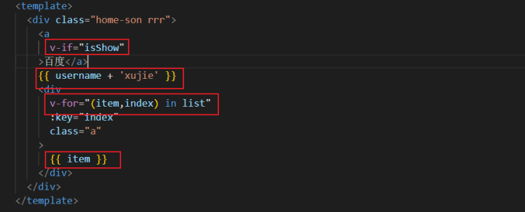
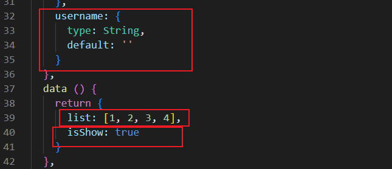
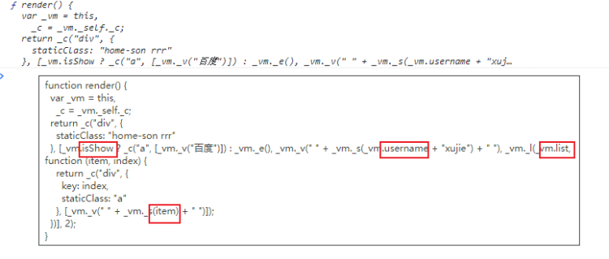
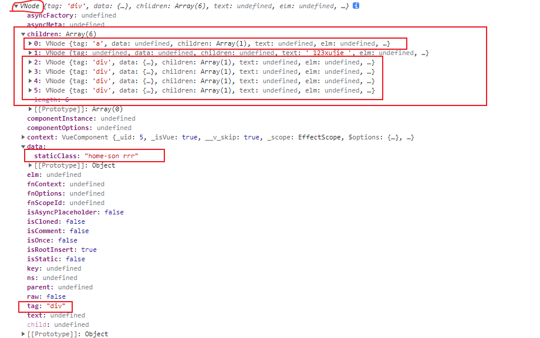
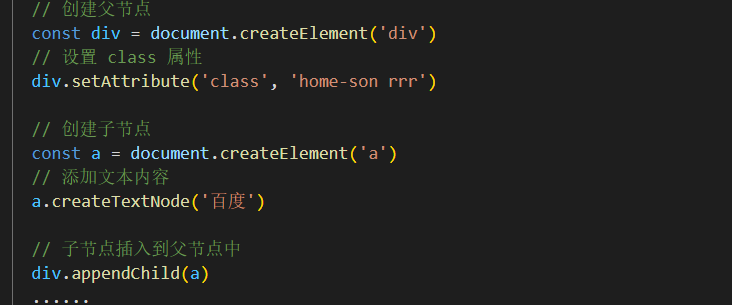
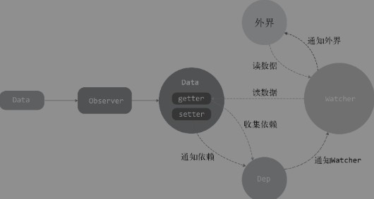
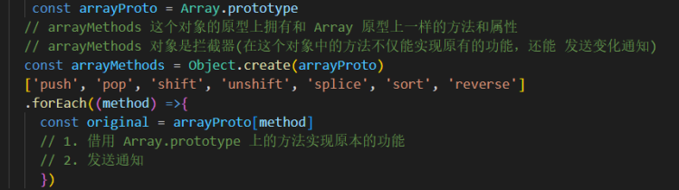
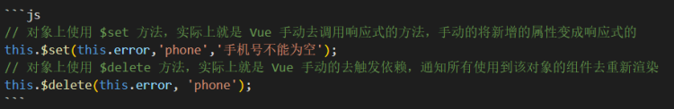
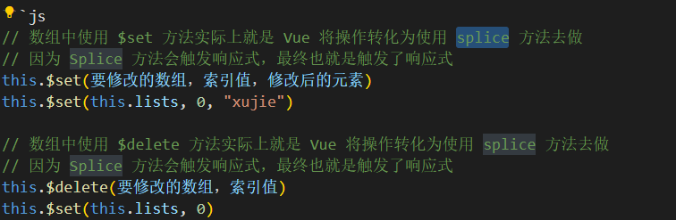

# Vue 的响应式数据

TODO： Vue3 响应式 API 的介绍，以及最佳实践

## 一，Vue的页面渲染

Vue.js的渲染过程是声明式的，我们通过模板来描述状态与DOM之间的映射关系。



Vue.js会自动通过状态生成DOM，并将其输出到页面上显示出来，这个过程叫渲染

### 1.1 页面的初次渲染

1. 将Vue 的类HTML语法模板编译成render 函数


Render 函数中也包含状态和DOM之间的映射关系(开发的时候也可以使用 render 函数的形式来写模板，可以省去 Vue 编译的过程)

1. Render 函数的执行会生成 VNode



1. 通过 patch 算法将 VNode 渲染成真正的 DOM 结构。



### 1.2 页面的更新

通常，在运行时应用内部的状态会不断发生变化，此时需要不停地重新渲染。Vue如何知道有哪些 DOM 结构需要被重新渲染？如何去更新 DOM 结构。

使用**变化侦测**的方式来解决这个问题。

1. 在哪里用到了(读取值)某个响应式数据，会在一个数组中记录这个地方(变化的追踪)
2. 当某个响应式数据被更新了(修改值),会根据这个值对应的数组去逐个更新。

Vue更新的粒度为 **中粒度**。即一个状态所绑定的依赖并不是具体的DOM结点也不是整个网页。而是一个组件，这样当状态发生变化后只会将通知发送给对应的组件。然后组件内部执行 render 函数基于当前最新的状态生成的最新 VNode 去和 旧的 VNode 进行对比。从而得知具体哪些 DOM 结构需要被更新。

## 二，Vue的响应式原理分析

### 2.1 Observer类

```js
function defineReactive(obj, key, value) {
  // 每个 key 值对应的依赖，存储在 dep 实例中
  let dep = new Dep();
    Object.defineProperty(obj, key, {
    configurable: true,
    enumerable: true,
    get() {
      // 收集依赖
      dep.depend();
      return value;
    },
    set(newValue) {
      val = newValue;
      // 触发依赖
      dep.notify();
    }
  });
}
```

### **2.2 Dep类**

可以简化看成是一个用来存储回调函数的数组
Window.target 是一个全局变量，方便依赖的收集

```js
// 定义一个 dep 类，专门用来管理依赖
class Dep {
  constructor() {
    this.subs = [];
  }
  addSub(sub) {
    this.subs.push(sub);
  }
  removeSub(sub) {
    remove(this.subs, sub);
  }
  depend() {
    if (window.target) {
      this.addSub(window.target);
    }
  }
  // 循环触发 dep 实例中依赖的 update 方法
  notify() {
    const subs = this.subs.slice();
    // 循环的触发所有依赖
    for (let index = 0; index < subs.length; index++) {
      subs[i].update();
    }
}
```

### **2.3 Watcher类**

可以简化看成是一个回调函数（回调函数的内容包含了要在哪里做？做什么事情）
Vue中的三种watcher: 1. 组件的render watcher 2. 计算属性watcher 3. $watcher 对应的watcher

```js
class Watcher {
  constructor(vm, expOrFn, cb) {
    this.vm = vm;
    // 执行 this.getter() ，就可以读取某个属性的值
    this.getter = parsePath(expOrFn);
    this.cb = cb;
    // 在实例化一个 watcher 实例的时候，会自动执行 get 方法
    this.value = this.get();
  }
  get() {
    window.target = this;
    let value = this.getter.call(this.vm, this.vm)
    window.target = undefined;
    return value
  }
  update() {
    const oldValue = this.value;
    this.value = this.get()
    this.cb.call(this.vm, this.value, oldValue)
  }
}
```

### 2.4 整体流程


**页面初始化时：** Observer 类会附加到每一个 object 上。递归的调用 defineReactive 函数将每一个属性都通过 Object.defineProperty() 进行数据拦截。在读取数据时会收集依赖，在修改数据后会触发依赖。每一个属性都会拥有一个独立的 Dep 实例
**页面使用数据时：**读取数据时会实例化一个 Watcher,在 new Watcher 的过程中会将 watcher 实例赋值给全局的变量(方便 dep 去收集)。然后默认读取一下该属性(读取该属性会触发依赖收集，从而将 watcher 实例放到响应式属性的 dep 中)
**改变数据后:** 改变数据会触发依赖执行，执行当前响应式属性的 dep 数组中的所有 watcher 的 update 方法(update 的回调函数 可能是执行组件的 render 函数，也可以是执行用户自定义的回调函数)

### **2.5 数组的响应式处理：**

处于性能和业务场景（大多数情况下是通过方法来改变数组，而非直接操作key/index 来改变数组）的考虑。数组不会针对每一条数据使用 Object.defineProperty() 进行数据拦截。
数组的响应式处理为在 get 中收集依赖，在数组方法中触发依赖。
**重写七个可改变数组的方法：**

替换响应式数组的原型
(所有需要响应式的值都要在 data 中声明，即使它目前是一个空值，也要占上位子)
2. 对象: Object.defineProperty 只能追踪一个属性是否被更改在一个对象中添加一个新属性，使用 delete 删除一个属性的时候不会触发响应式。
3. 数组：push()pop()shift()unshift()splice()sort()reverse()称为变更方法，会触发视图更新。数组长度的变化是非响应式的， arr.length = 4。通过索引来直接修改数组中的数据也是非响应式的 arr[2] = 'xujie'

### 3.2 缺陷的解决方案

Vue.set(object, 'key', 'value')          Vue.delete(object, ‘key)



## 四，Vue 3的响应式原理

### 4.1 使用 proxy 监听对象的行为

```js
// 原始的数据
const obj = {
  name: 'xujie'
}

// 将原始数据的读写进行代理拦chogxi
const myObj = new Proxy(obj, {
  // 拦截读取的操作
  get(target, key) {
    // 将当前被激活的副作用函数添加到对应 target[key] 的桶中
    track(target, key)
    // 返回属性值
    return target[key]
  },
  // 拦截设置属性的操作
  set(target, key, newVal) {
    // 设置属性值
    target[key] = newVal
    // 将对应 target[key] 值桶中的所有副作用函数拿出来，并执行
    trigger(target, key, newVal)
    return true
  }
})
```

### 4.2 Proxy 和Object.definePrototy() 对比

1. 通过Proxy（代理）能够拦截对象中任意属性的变化, 包括：属性值的读写、属性的添加、属性的删除等。
2. Proxy 是对整个对象的监听。Object.definePrototy() 是对某个属性的监听。当对象嵌套层级较深时，proxy的性能较好
3. Proxy 是 ES6 的语法，兼容性较差（有点问题，但问题不大）
