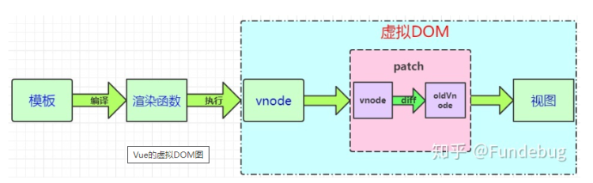

# Vue 的页面渲染

## 一，Vue的虚拟DOM



1. **状态：**就是开发者定义和操作的数据(数组，对象，字符串，数字等等)
2. **模板：** `<template>` 标签之间的内容。我们使用模板来描述状态与 DOM 之间的映射关系
3. **渲染函数：**vue 通过编译将 template 模板转换为渲染函数(rander)，执行渲染函数就能够得到 Virtual DOM。如果编码过程中不写 template 而是直接写 rander 函数能够得到更高的性能。
4. **Virtual DOM**虚拟结点，是结点的描述对象，描述了应该怎样去创建真实的 DOM 结点。
5. **patch 算法：**最终目的是将 Virtual DOM 渲染成真实的 DOM。但是 patch 算法中还使用了 diff 算法(渲染过程中的一种优化方案)。使得 Vue 可以不必暴力绘制全部的 DOM 结点。而是对比新旧结点的不同。仅仅对需要更新的 DOM 结点进行更新。

## 二，Vue借用虚拟 DOM 更新和原生操作 DOM 更新

**1.命令式代码更新的性能消耗：** 更新数据 + 渲染 DOM
**2.声明式代码更新的性能消耗：** 更新数据 + 查找差异 + 渲染 DOM

声明式代码更新的性能**理论上**不会好于命令式代码更新(此处的命令式代码更新指的是极致优化的情况下)，因为虚拟 DOM 会多一次查找差异的过程。

### **操作DOM的代码是昂贵的！**

操作对象:

```js
const app = []
console.time("操作对象")
for(let index = 0; index < 1000; index++) {
  const div = { tag: "div", class: "child" }
  app.push(div)
}
console.timeEnd("操作对象")

// 操作对象：0.133056640625 ms
```

操作DOM:

```js
const app = document.querySelector("#app")
console.time("操作DOM")
for(let index = 0; index < 1000; index++) {
  const div = document.createElement("div")
  div.setAttribute("class", "child")
  app.appendChild(div)
}
console.timeEnd("操作DOM")

//  操作对象：1.419921875 ms
```

假设场景: 一个列表数组中有100条数据，在进行一次操作之后需要删除数组前10条数据，末尾添加10条数据。

**操作原生DOM(没有优化手段)**: 直接将最新的100条数据进行循环渲染。
  耗费性能: 删除100个DOM，添加100个DOM
  编码难易: 虽然需要操作DOM，但是操作手段简单粗暴。不需要考虑DOM 的变化点

**借用虚拟DOM**: 先查找差异，再针对变化的部分进行渲染
  耗费性能: 删除10 个DOM, 添加 10 个DOM 加上 寻找差异的时间
  编码难易: 声明式的代码，不需要操作 DOM，编码简单，程序有可维护性

**操作原生DOM(极致优化):** 开发者要明确 DOM的变化。手动对需要变动的地方操作 DOM
  耗费性能: 删除 10个 DOM, 添加10 个DOM
  编码难易: 需要明确DOM的变化点, 需要手动进行大量 DOM 操作。程序可维护性差。

### **结论(权衡的艺术)**

****DOM其实是树形结构，在真实的业务中手动优化DOM的复杂性应该会更高。开发者很难写出绝对优化的命令式代码。并且写极致优化代码本身也会耗费巨大精力。投入产出比并不高。借用虚拟 DOM 来更新页面，能保证开发者既能享受到声明式代码的便利之处和可维护性，又能得到一个相对不错的性能。

## 三，Diff算法

1. diff 算法用来比较两个 Virtual DOM 树的差异，diff 算法只会比较同一个层级的元素。diff 算法不会跨层级比较。因为跨层级改变 DOM 的情况很少(能够有效减少 diff 算法的时间复杂度)
2. diff 算法在同层级比较结点时，例如在比较第二层的 div 时，发现新旧虚拟结点有不同，不会再进行 div 下一层的比较而是直接将第二层结点整个更新(即使第三层的子节点有相同的结点也不再复用
3. 采用深度优先算法

## 四，Vue中的key值

> 当 Vue 正在更新使用 `v-for` 渲染的元素列表时，它默认使用“就地更新”策略。如果数据项的顺序被改变，Vue 将不会移动 DOM 元素来匹配数据项的顺序，而是就地更新每个元素，并且确保它们在每个索引位置正确渲染。这个类似 Vue 1.x 的 `track-by="$index"`

**触发时机**:  Vue 会使用一种最大限度减少动态元素并且尽可能的尝试修复/再利用相同类型元素的算法。 Vue 在进行 VNode 对比时会看两个东西: tag 和 key。如果这两个东西都相同则会复用 DOM 结构，只更新其中的数据
**适用场景**: 单纯的展示列表数据(具有分页功能)。在切换页面时由于都是相同的结构，所以并不存在 DOM 元素的删除与创建。只需要更新其中的数据

Vue 列表的 key 值

适用场景:

1. 列表数据会被打乱顺序（如上图）
2. 具有相同 DOM 结构的组件相互切换(加入key 值之后，input 中的数据不会复用，会触发这两个组件完整的生命周期，说明真的进行了销毁和重建这个过程)(eg: 登录/注册表单的切换)

## 五，Vue的nextTick

5.1 `官网解释:` this.$nextTick(() => {}) 将回调函数延迟到下次 DOM 更新周期之后执行。在修改数据之后立即使用它，然后等待 DOM 更新。
5.2 `出现原因:` Vue 在修改状态之后，DOM 不会立刻同步更新(采用异步更新的方式)， 而是等 `同一事件循环`(同一事件循环指的是在一个宏任务中) 中的所有数据变化完成之后。在统一进行 DOM 更新。
5.3 `现实意义:` 异步渲染最终目的是，将多次数据变化所引起的响应变化收集后合并成一次页面渲染，从而更合理的利用机器资源，提升性能与用户体验。
数据变化 –> 收集 watcher -> 执行render() 生成最新的VNode -> diff 找出差异 -> 更新差异部分(渲染DOM)

### 适用场景

1. 对一个数据连续更改多次：页面只会渲染最终的状态，防止界面的闪烁
2. 连续多次更改数据：合并 收集watcher 之后的流程，减少性能消耗
