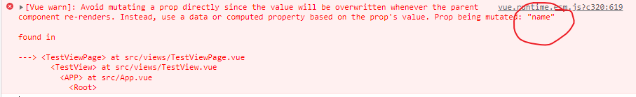
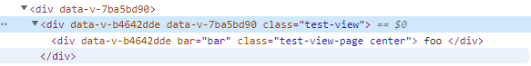
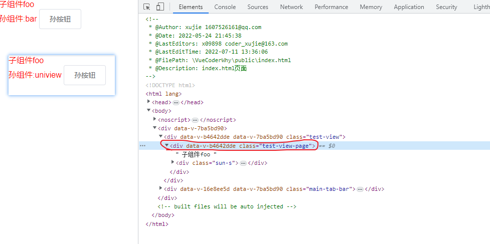
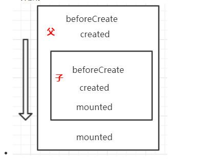
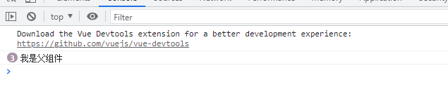

# 组件通信

## 父子组件通信

* 单向数据流：
  
1. 父组件中的 props 更新会自动的流入子组件中
2. 不可以在子组件中直接修改父组件传过来的值(无论是基本类型还是引用类型)
3. 优点：组件数据变化的来源入口只有一处，便于数据变化流程的理解(eg:多个子组件依赖同一个父组件的数据，在其中一个子组件中修改数据会引起其他所有组件的变化, 对于其他子组件来说很难找到数据的变化来源于哪里)

```js
  props: {
    name: {
      type: String,
      default: ''
    },
    info: {
      type: Object,
      default: () => ({})
    }
  },
  created() {
    this.name = 'ddd'
    this.info.age = 20
  }
```



虽然在子组件中修改父组件传过来的引用类型数据不会报错，但是不推荐这种写法。

```js
// 需要在自组件内修改父组件传进来的值
<input v-model="sName"><input>
data() {
  return {
    sName: this.name // 使用一个中间变量进行一次拷贝
  }
},
props: {
  name: {
    type: String,
    default: ''
  }
}
```

### props 和 $emit()

* 通过 props 来向子组件传递数据，通过 $emit() 来向父组件提交事件修改数据

```js
// 传递数据&监听事件
<test :name="name" @handler-click = changeName></test>
methods: {
  changeName(name) {
    this.name = name
  }
}
// 提交事件
<div class="test">
  {{ name }}
  <button @click="$emit('handler-click', 'uniview')">按钮</button>
</div>
```

* 通过 props 传递了数据，但是子组件没有通过 props 声明

```js
// 父组件向子组件传递数据
<test-view-page :foo="foo" :bar="bar" :class="abc"></test-view-page>
data() {
  return {
    foo: 'foo',
    bar: 'bar',
    abc: 'center'
  }
}
// 子组件接受部分数据
<div class="test-view-page" bar="xujie">
  {{ foo }}
</div>
props: {
  foo: {
    type: String,
    default: ''
  }
}
```



子组件没有显式接受的数据会被当做子组件根节点的 attribute 属性

* 使用 $attrs 和 $listeners实现多层透传

```js
// 父组件通过 props 传递数据，并且监听孙组件提交的事件
<test :foo="foo" :bar="bar" @up-bar="changeBar" ></test>
data() {
  return {
    foo: 'foo',
    bar: 'bar',
  }
},
methods: {
  changeBar(bar) {
    this.bar = bar
  }
}
// 子组件显式接受 foo 变量，并且透传 bar , 并且透传 up-bar 事件
<son-s v-bind="$attrs" v-on="$listeners"></son-s>
inheritAttrs: false, // 禁止未用 props 显式声明的属性添加到 DOM attribute 中
name: 'TestViewPage',
props: {
  foo: {
    type: String,
    default: ''
  }
}
// 孙组件接受 bar 变量，并且提交 up-bar 事件
<el-button @click="$emit('up-bar', 'uniview')">孙按钮</el-button>
```



### 双向数据绑定

#### v-model

* 双向绑定并没有违背单向数据流。v-model 本质上是一个语法糖，同时使用了两个指令

1. :value="value"  
2. @input="value = $event"

```js
// 在组件上可以直接使用 v-model API
<test-view-page v-model="name"></test-view-page>
// 不使用 v-model 语法糖
<test-view-page :value="name" @input="name = $event"></test-view-page>

// 在子组件中通过 model 来指定 v-model 会绑定的值和监听的事件
<template>
  <div class="test-view-page">
    <input :value="value" @input="$emit('input', $event.target.value)">
  </div>
</template>
model: {
  prop: 'value',
  event: 'input'
},
props: {
  value: {
    type: String,
    default: ''
  }
}
```

#### .sync 修饰符

```js
// 父组件使用 sync 修饰符 
<test-view-page :visible.sync="isShow"></test-view-page>
// 父组件不使用 sync 修饰符
<test-view-page :visible="isShow" @update:visible = "visible = $event"></test-view-page>

// 子组件中定义
<div class="test-view-page">
  <div v-if="visible">我是不一定可见的</div>
  <button @click="$emit('update:visible', false)">隐藏</button>
</div>
props: {
  visible: {
    type: Boolean,
    default: true
  }
}
```

#### 两者的对比

1. 都是语法糖，同时使用了属性绑定和事件监听两个 Vue 指令
2. v-model 可以通过 model 模块指定要绑定的变量和监听的事件，适用于添加到表单元素上
3. .sync 更倾向于对其他类型变量的绑定(element 组件有很多支持这个修饰符 eg: dialog 对话框)

### 直接访问组件的方法/属性

1. $children 是一个数组，数组里面是当前组件所有的子组件对象(慎用，破坏组件的独立性)
2. $parent 是一个数组，数组里面是当前组件的父组件对象(同上)
3. $refs 添加到子组件上，就可以通过 $refs.name.xxx 访问子组件的属性和方法

## 非父子组件通信

### 事件总线

* 使用事件总线来实现跨组件之间的通信

```js
// 在 Vue 原型上添加一个属性
Vue.prototype.$bus = new Vue()

// 在提交事件的组件内提交事件
this.$bus.$emit('itemImageLoad',index);

// 在处理事件的组件内监听事件
this.$bus.$on('itemImageLoad',(index) => {
  console.log(index);
});
```



要保证事件的监听发生在事件的提交之前(在没有开启对应监听的情况下就提交事件，会导致事件的丢失)
父子组件之间可以通过关系图来保证监听和提交的先后顺序，但是兄弟组件之间如何确定先后顺序？

### Vuex

* 官方推荐在 Vue2 生态中需要使用的插件

## 扩展

* 把父组件中的函数当做变量传递给子组件调用

```js
// 父组件内通过 props 传值给子组件S
<test-view-page :sEvent="outputName"></test-view-page>
data() {
  return { name: '我是父组件' }
},
methods: {
  outputName() { console.log(this.name) }
}
// 子组件内调用父组件传递过来的方法
<button @click="sEvent">点击</button>
props: {
  sEvent: {
    type: Function,
    default: () => {}
  }
},
data() {
  return { name: '我是子组件' }
}
```



vue 组件实例化的时候会把定义时的 method 的函数 bind this 到实例上，bind 之后 this 就定死了
