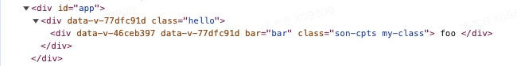

# 组件通信

## 一、父子组件通信

### 1.1 props 和 $emit()

#### (1) 单向数据流

> 所有的 props 都遵循着`单向绑定`原则，props 因父组件的更新而变化，自然地将新的状态`向下流`往子组件，而`不会逆向传递`。这避免了子组件意外修改父组件的状态的情况，不然应用的数据流将很容易变得混乱而难以理解。
> 另外，每次父组件更新后，所有的子组件中的 props 都会被更新到最新值，这意味着你不应该在子组件中去更改一个 prop。若你这么做了，Vue 会在控制台上向你抛出警告：

1. 父组件中的 props 更新会自动的流入子组件中
2. 不可以在子组件中直接修改父组件传过来的值(无论是基本类型还是引用类型)
3. 优点：组件数据变化的来源入口`只有一处`，便于数据变化流程的理解(eg: 多个子组件依赖同一个父组件的数据，在其中一个子组件中修改数据会引起其他所有组件的变化, 对于其他子组件来说很难找到数据的变化来源于哪里)

```js
props: {
  person: {
    type: Object,
    required: false
  },
  myName: {
    type: String,
    required: false
  }
},
created() {
  this.myName = 'foo'  // 报错警告
  this.person = {      // 报错警告
    job: "WEB",
    age: 29
  }
  this.person.age = 29  // 不报错
},
```


* 虽然在子组件中修改父组件传过来的`引用类型数据的属性`不会报错(Vue 出于性能的考虑，没有对引用类型的属性修改做限制)，但是不推荐这种写法。

##### Vue 推荐 Props 修改方式

```js
// 1. Props 被用于传入初始值，子组件重新声明局部数据
data() {
  return {
    sonName: this.myName 
  }
},
// 2. 基于 Props 定义一个计算属性
computed:{
  sonFormatName () {
    return this.myName.toUpperCase()
  }
},
```

#### (2) 通过 props 来向子组件传递数据，通过 $emit() 来向父组件提交事件修改数据

##### Vue2 的写法

```js
// 1. 父组件传值&修改数据
<SonCpt
  :person="person"
  :my-name="myName"
  @update-person="(number) => updatePerson(number)"
  @update-name="updateName"
></SonCpt>
import SonCpt from "../components/son-cpts.vue";
data: function () {
  return {
    person: {
      job: "WEB",
      age: 25,
    },
    myName: "xujie",
  };
},
methods: {
  updatePerson(number) {
    this.person.age += number
  },
  updateName(newName) {
    this.myName = newName
  }
},

// 2. 子组件接收值&提交事件
props: {
  person: {
    type: Object,
    required: false,
    default: () => ({
      job: "APP",
      age: 18,
    }),
  },
  myName: {
    type: String,
    required: true
  },
},
methods: {
  updatePerson() {
    this.$emit('update-person', 1)
  },
  updateName() {
    this.$emit('update-name', 'Snow')
  }
},
```

##### Vue3 的写法

```TS
// 1. 父组件传值&修改数据
<sonCpts
  :person="person"
  :myName="myName"
  @update-person="number => updatePerson(number)"
  @update-name="updateName"></sonCpts>
import sonCpts from '../cpts/son-cpts.vue'
const person = reactive({
  job: 'WEB',
  age: 25,
})
const myName = ref('xujie')
function updatePerson(number: number) {
  person.age += number
}
function updateName(newName: string) {
  myName.value = newName
}

// 2. 子组件接收值&提交事件
interface IProps {
  person?: {
    job: string
    age: number
  }
  myName: string
}
withDefaults(defineProps<IProps>(), {
  person: () => ({
    job: 'APP',
    age: 18,
  }),
})
const emits = defineEmits<{
  (e: 'update-person', number: number): void
  (e: 'update-name', newName: string): void
}>()
function updatePerson() {
  emits('update-person', 1)
}
function updateName() {
  emits('update-name', 'Snow')
}
```

#### （3）透传

* 子组件没有显式接受的数据会被当做子组件根节点的 attribute 属性
* 绝大多数 attribute 来说，从外部提供的值会替换掉组件内部设置好的值
* `class` `style` 会和组件内部的值进行合并

```js
// 父组件向子组件传递数据
<SonCpt :foo="foo" :bar="bar" :class="sonClass"></SonCpt>
data() {
  return {
    foo: 'foo',
    bar: "bar",
    sonClass: 'my-class'
  };
},
// 子组件接受部分数据
<div class="son-cpts" bar="sonBar"> {{ foo }} </div>
props: {
  foo: {
    type: String,
    required: true
  }
}
```



* 可以通过 `inheritAttrs: false` 来关闭组件的根元素继承 attribute(不会影响 style 和 class 的绑定)

##### Vue2 写法

* 使用 `$attrs` 和 `$listeners` 实现多层透传
* $attrs: 包含了父作用域中不作为 prop 被识别 (且获取) 的 attribute 绑定 (class 和 style 除外)。当一个组件没有声明任何 prop 时，这里会包含所有父作用域的绑定 (class 和 style 除外)，并且可以通过 v-bind="$attrs" 传入内部组件
* $listeners: 包含了父作用域中的 (不含 .native 修饰器的) v-on 事件监听器。它可以通过 v-on="$listeners" 传入内部组件

```js
// 1. 父组件通过 props 传递数据，并且监听孙组件提交的事件
<SonCpt :foo="foo" :bar="bar" @update-bar="updateBar"></SonCpt>
data() {
  return {
    foo: 'foo',
    bar: 'bar',
  }
},
methods: {
  changeBar(bar) {
    this.bar = bar
  }
}

// 2. 子组件显式接受 foo 变量，并且透传 bar , 并且透传 update-bar 事件监听器
<SunCpts v-bind="$attrs" v-on="$listeners"></SunCpts>
inheritAttrs: false,
props: {
  foo: {
    type: String,
    required: true,
  },
}

// 3. 孙组件接受 bar 变量，并且提交 up-bar 事件
<div class="sun-cpts" @click="$emit('update-bar', 'sunBar')"> {{ bar }} </div>
props: {
  bar: {
    type: String,
    required: true
  }
}
```

##### Vue3 写法

1. 去掉了 `$listeners` API 属性和事件都会通过 `$attrs` 来传递
2. 由于 Vue3 支持碎片(一个组件可以多个根元素)所以在子组件不仅一个根元素时，需要开发者手动控制 `$attrs` 数据的走向

```js
// 1. 父组件通过 props 传递数据，并且监听孙组件提交的事件
<SonCpts :foo="foo" :bar="bar" @update-bar="updateBar"></SonCpts>

// 2. 子组件显式接受 foo 变量，并且透传 bar , 并且透传 update-bar 事件监听器
<template>
  <div class="son-content">son</div>
  <SunCpts v-bind="$attrs"></SunCpts> // 拥有多个根节点时，必须手动指定 `$attrs` 赋值给谁
</template>
interface IProps {
  foo: string
}
defineProps<IProps>()

// 3. 孙组件接受 bar 变量，并且提交 up-bar 事件
<div @click="$emit('update-bar', 'sunBar')">
  {{ bar }}
</div>
interface IProps {
  bar: string
}
defineProps<IProps>()
defineEmits<{
  (e: 'update-bar', newBar: string): void
}>()
```

### 1.2 依赖注入 (Vue3 语法)

1. 依赖注入更加方便跨组件传值
2. 依赖注入不仅可以用来跨组件传值，还可以用来声明全局变量

```js
// 1. 在 父组件中 provide 数据&更改数据的方式
const foo = ref('foo')
function updateFoo(newFoo: string) {
  foo.value = newFoo
}
provide('foo', {
  foo,
  updateFoo,
})

// 2. 在子组件中 inject 数据&更改数据的方法
const { injectInfo, updateInjectInfo } = inject(injectInfoKey);
interface IFoo {
  foo: Ref<string>
  updateFoo: (newFoo: string) => void
}
const { foo, updateFoo } = inject('foo') as IFoo

// 3. 注册全局的变量
app.provide('key', 'value')
```

### 1.3 双向数据绑定

#### （1）v-model

* 双向绑定并没有违背单向数据流。v-model 本质上是一个语法糖，同时使用了两个指令

1. :value="value"
2. @input="value = $event"

```js
// 在组件上可以直接使用 v-model API
<test-view-page v-model="name"></test-view-page>
// 不使用 v-model 语法糖
<test-view-page :value="name" @input="name = $event"></test-view-page>

// 在子组件中通过 model 来指定 v-model 会绑定的值和监听的事件
<template>
  <div class="test-view-page">
    <input :value="value" @input="$emit('input', $event.target.value)">
  </div>
</template>
model: {
  prop: 'value',
  event: 'input'
},
props: {
  value: {
    type: String,
    default: ''
  }
}
```

#### （2）.sync 修饰符

```js
// 父组件使用 sync 修饰符
<test-view-page :visible.sync="isShow"></test-view-page>
// 父组件不使用 sync 修饰符
<test-view-page :visible="isShow" @update:visible = "visible = $event"></test-view-page>

// 子组件中定义
<div class="test-view-page">
  <div v-if="visible">我是不一定可见的</div>
  <button @click="$emit('update:visible', false)">隐藏</button>
</div>
props: {
  visible: {
    type: Boolean,
    default: true
  }
}
```

#### （3）两者的对比

1. 都是语法糖，同时使用了属性绑定和事件监听两个 Vue 指令
2. v-model 可以通过 model 模块指定要绑定的变量和监听的事件，适用于添加到表单元素上
3. .sync 更倾向于对其他类型变量的绑定(element 组件有很多支持这个修饰符 eg: dialog 对话框)

### 1.4 直接访问组件的方法/属性

1. $children 是一个数组，数组里面是当前组件所有的子组件对象(慎用，破坏组件的独立性)
2. $parent 是一个数组，数组里面是当前组件的父组件对象(同上)
3. $refs 添加到子组件上，就可以通过 $refs.name.xxx 访问子组件的属性和方法(Vue3 需要使用 defineExpose 指定暴露的属性)

## 二、非父子组件通信

### 2.1 事件总线

* 使用事件总线来实现跨组件之间的通信

```js
// 在 Vue 原型上添加一个属性
Vue.prototype.$bus = new Vue();

// 在提交事件的组件内提交事件
this.$bus.$emit("itemImageLoad", index);

// 在处理事件的组件内监听事件
this.$bus.$on("itemImageLoad", (index) => {
  console.log(index);
});
```


要保证事件的监听发生在事件的提交之前(在没有开启对应监听的情况下就提交事件，会导致事件的丢失)
父子组件之间可以通过关系图来保证监听和提交的先后顺序，但是兄弟组件之间如何确定先后顺序？

### 2.2 Vuex

* 官方推荐在 Vue2 生态中需要使用的插件

### 2.3 Pinia

* 官方推荐在 Vue3 生态中使用的插件

```ts
export const useUserInfoStore = defineStore('userInfo', () => {
  // 定义data，相当于 Vuex 中的 store
  const userList = reactive([
    { name: 'xujie', age: 25 },
    { name: 'tom', age: 30 },
  ])

  // 定义计算属性，相当于 Vuex 中的 getter
  const adultList = computed(() => {
    return userList.filter(user => user.age >= 18)
  })

  // 定义方法，相当于 Vuex 中的 action   (Pinia 中没有 mutation 的概念)
  function addUser() {
    userList.push({ name: 'Anna', age: 18 })
  }

  return { userList, adultList, addUser }
})
```

### 2.4 全局依赖注入(Vue3)

```TS
// 提供
app.provide('message', 'hello')
// 注入
const message = inject('message')
```

## 三、扩展

* 把父组件中的函数当做变量传递给子组件调用

```js
// 1. 父组件内通过 props 传值给子组件
<test-view-page :sEvent="outputName"></test-view-page>
data() {
  return { name: '我是父组件' }
},
methods: {
  outputName() { console.log(this.name) }
}

// 2. 子组件内调用父组件传递过来的方法
<button @click="sEvent">点击</button>
props: {
  sEvent: {
    type: Function,
    default: () => {}
  }
},
data() {
  return { name: '我是子组件' }
}
```


* vue 组件实例化的时候会把定义时的 method 的函数 bind this 到实例上，bind 之后 this 就定死了
