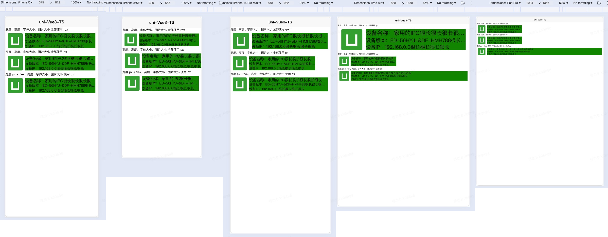
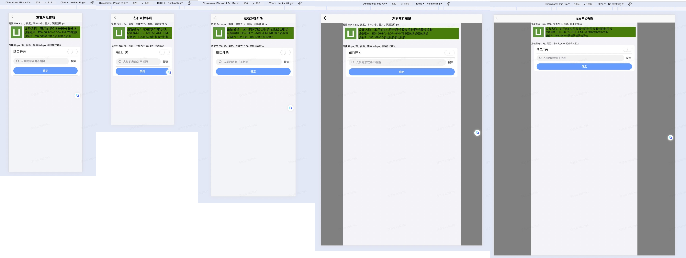

# WEB响应式

## 1. flex

### 基本语法(示例)

* Xmind 工具

### 打点省略的问题

## 二、uni-app rpx 单位

### 2.1 内容适应两种策略

1. 局部拉伸：页面内容划分为`固定区域`(px)和`长宽动态适配区域`(flex自动适配)
2. 等比缩放：根据页面`屏幕宽度`缩放(rpx 属于这种方案)

### 2.2 rpx 概念，原理

* uni-app 中认为屏幕的宽度始终为 750rpx, 并且会根据屏幕的宽度来动态设置 rpx 的实际大小
* 公司设计师按照 375 px 出图。则 1 rpx = (375/750) px。也就是 1px = 2rpx

### 模拟 rpx 单位

### rpx 注意事项

* 960 px(相关配置项)
* 最好不要用于 高度和字体大小

### 3. rpx 和 flex + px 的各类场景

* 左侧固定宽度，右侧自适应
* 表单的场景

#### 表单元素



1. u-view 组件的内置元素没有使用默认的 rpx
2. 组件内部的样式覆盖繁琐，且存在影响功能问题(u-switch 切换时存在问题)

```scss
// 当前页面需要全覆盖 rpx 单位时，需要新增的 CSS 代码量
::v-deep .u-switch {
  width: 104rpx !important;
  height: 54rpx !important;
  &__bg {
    width: 75rpx !important;
    height: 50rpx !important;
  }
  &__node {
    width: 50rpx !important;
    height: 50rpx !important;
    transform: translateX(-50rpx) !important;
  }
}
::v-deep .u-search {
  .u-icon {
    span {
      font-size: 44rpx !important;
    }
  }
  &__content__input {
    height: 64rpx !important;
  }
  .uni-input-placeholder {
    font-size: 28rpx;
  }
  &__action {
    width: 80rpx;
    span {
      font-size: 28rpx !important;
    }
  }
}
::v-deep .u-button {
  height: 72rpx;
  span {
    font-size: 28rpx !important;
  }
}
```

#### 总结

* 布局宽、布局高、字体大小、页面元素全部使用 rpx

1. 上手简单，使用便捷。只需要按照一个标准尺寸宽度(375px)的设备进行调试，其他宽度的设备只不过是整个页面所有元素的大小缩放而已。不需要在意比当前宽度小的设备出现遮挡，覆盖等问题
2. 组件库默认单位并不是 rpx, 需要从头到尾去覆盖，工作量大且容易出问题(平板设备问题严重，手机设备影响相对较小)
3. 平板设备虽然在显示上没有问题，但是效果很差，字体极大，由于平板的 W/H 数值低，一屏中可呈现的信息量较少

* 只有布局宽度使用 rpx, 布局高，字体大小、页面元素等使用 px + flex

1. 在标准尺寸宽度(375px)的设备调试完成后，需要额外注意小于当前尺寸设备的显示情况(布局宽度小了，但是页面元素没小，容易出现遮挡，覆盖问题)(情况较少，一般布局在宽度上都是有伸缩空间的)
2. 平板设备下元素长度被拉长，不太美观

### 4. 对平板场景的适配

* 裁定一个合适的断点， 例如 600px。 当屏幕宽度小于 600px 时，每 rpx 的真实大小随着屏幕变化，当屏幕宽度大于 600px 时，每 rpx 的实际大小按照 600px 来计算

```js
// page.json 
"globalStyle": {
  "rpxCalcMaxDeviceWidth": 600, // rpx 计算所支持的最大设备宽度，单位 px
  "rpxCalcBaseDeviceWidth": 600, // rpx 计算使用的基准设备宽度，设备实际宽度超出 rpx 计算所支持的最大设备宽度时将按基准宽度计算，单位 px
}

// App.vue
<style lang="scss">
page {
  max-width: 600px;
  margin: 0 auto;
}
</style>
```



## 三、对 PC 端的适配

* 同时也不是所有的网页都适合响应式。
* TODO: 补充更加具体的方案和措施

### 页面元素显隐策略

* 通过媒体查询功能规划几类断点， 在断点区间内使用响应式单位 + flex 进行元素大小自适应。在不同断点情况下，进行页面结构(header, content, footer, aside)和交互形式(列表、弹出列表)的改变。

### 组件库的适配

* 一般也要求组件有交互习惯的改变(PC 端的交互和 移动端的交互有一些不一样。eg: 删除，PC 可能就是一个固定按钮，而组件会是左滑删除的形式，分页查询：PC 可能是按钮选择，手机是上拉加载)