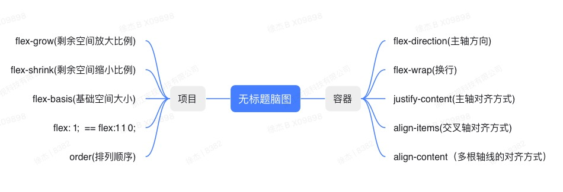
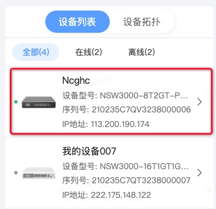

# WEB响应式

## 一、flex

### 1.1 基本语法



### 1.2 打点省略的问题



* 在自适应元素上加 `width: 0;` `overflow: hidden;` 可解决打点失效问题

```css
.container {
  display: flex;
  flex-direction: row;
}
.logo {
  flex: 0 0 100px;
}
.device-info {
  flex: 1 1 0;
  /* width: 0; */  
  /* overflow: hidden; */
}
.device-name {
  overflow: hidden;
  white-space: nowrap;
  text-overflow: ellipsis;
}
```

## 二、uni-app rpx 单位

### 2.1 内容适应两种策略

1. 局部拉伸(效果更好)：页面内容划分为`固定区域`(px)和`长宽动态适配区域`(flex自动适配)
2. 等比缩放(使用更简单)：根据页面`屏幕宽度`缩放(rpx 属于这种方案)

### 2.2 rpx 的使用

* uni-app 中认为屏幕的宽度始终为 `750rpx`, 并且会根据屏幕的宽度来`动态设置 rpx 的实际大小`
* 公司设计师按照 375 px 出图。则 1 rpx = (375/750) px。也就是 1px = 2rpx
* 虽然移动设备(不包含平板)也有很多的屏幕宽度，但是各种移动设备的屏幕差异不是很大，相对于 375px 微调缩放后的显示效果还不错，尽可能的还原了设计师的设计。

### 2.3 rpx 注意事项

```json
{
  "globalStyle": {
    "rpxCalcMaxDeviceWidth": 960, // rpx 计算所支持的最大设备宽度，单位 px，默认值为 960
    "rpxCalcBaseDeviceWidth": 375, // rpx 计算使用的基准设备宽度，设备实际宽度超出 rpx 计算所支持的最大设备宽度时将按基准宽度计算，单位 px，默认值为 375
    "rpxCalcIncludeWidth": 750 // rpx 计算特殊处理的值，始终按实际的设备宽度计算，单位 rpx，默认值为 750
  },
}
```

1. 当屏幕宽度小于 960 px 时，rpx 单位会根据屏幕的宽度进行动态变化(屏宽则一切变大，屏窄则一切变小)
2. 当屏幕宽度大于 960 px 时，rpx 单位会失效，按照 375 px 进行显示(平板机型 Ipad Pro 屏宽超过 960px)
3. 750 rpx 是一个特殊值(会无视 rpxCalcMaxDeviceWidth 的影响)，无论何时都按照屏幕的最大宽度来计算(实测Vue3版本不生效)(官方强烈不建议将 750rpx 当做 100% 来使用)

> 很多开发者对响应式单位的依赖过于严重了, 比如组件高度和字体大小也使用 rpx，注意：只有当你需要某元素的单位要根据屏幕`宽度(小范围)`大小变化时，才需要使用 rpx 这类动态宽度单位

### 2.4 模拟 rpx 单位

* 通过 CSS 的 rem 单位来实现响应式单位

```ts
/**
 * 动态为根元素设置字体大小
 */
function init() {
  /** 设计图尺寸 */
  const designSize = 1080
  // 获取屏幕宽度
  const width = document.documentElement.clientWidth
  // 设置根元素字体大小(rem)
  document.documentElement.style.fontSize = width / designSize + 'px'
  console.info(`当前宽度为: ${width}px, 当前每rem代表: ${width / designSize}px`)
}

// 首次加载应用，设置一次
init()
// 监听手机旋转的事件的时机，重新设置
window.addEventListener('orientationchange', init)
// 监听手机窗口变化，重新设置
window.addEventListener('resize', init)
```

## 三、rpx 和 flex + px 的各类场景对比

### 3.1 测试设备尺寸介绍(信息来源于 chrome devtools)

1. IPhone5/SE: 320 * 568  H/W: 1.7 (小屏手机)
2. IPhoneX:    375 * 812  H/W: 2.1 (一般手机)
3. IPhone14 Pro MAX:  430 * 932  H/W: 2.1 (大屏手机)
4. IPad Air:   820 * 1180  H/W: 1.4  (一般平板)
5. IPad Pro:   1024 * 1366  H/W: 1.3 (大屏平板)

### 3.2 左侧固定，右侧自适应


### 3.3 表单的使用

## 四、对平板场景的适配

* max-width + margin auto
* 使用媒体查询是否能做到更精确一些。

## 五、对 PC 端的适配

* 适配方案：根据屏宽动态显示和隐藏内容
* 必要性
* PC 和 APP 通用网站的示例，其他人都是怎样做的（uni-app 新闻，Vuetify 官网）
* 一般也要求组件有交互习惯的改变(PC 端的交互和 移动端的交互有一些不一样。eg: 删除，PC 可能就是一个固定按钮，而组件会是左滑删除的形式，分页查询：PC 可能是按钮选择，手机是上拉加载。)
* 基本上都需要搭配上媒体查询。规划几类断点(手机，平板、电脑)。这个不是简单的宽度大小适配的问题。通常都搭配着页面结构的改变(PC 上：导航栏，左：配置项栏目，右：内容区，下公司信息  手机：上：标题  左右下： 无  中间：内容区，导航栏和配置项栏目需要放到其他页面中)
* 同时也不是所有的网页都适合响应式。
* TODO: 具体的方案和措施