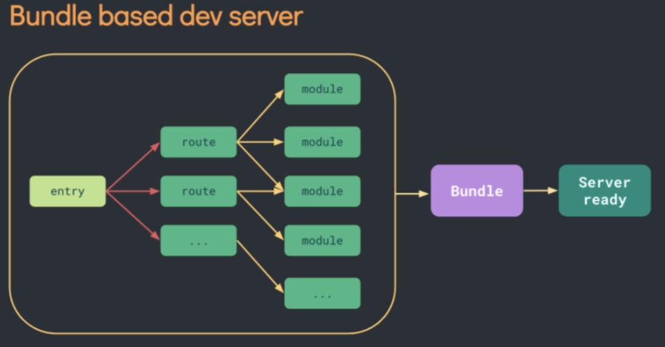
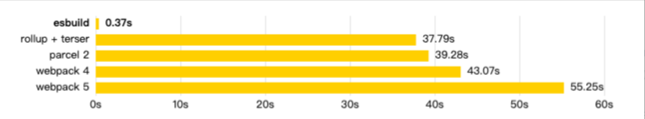
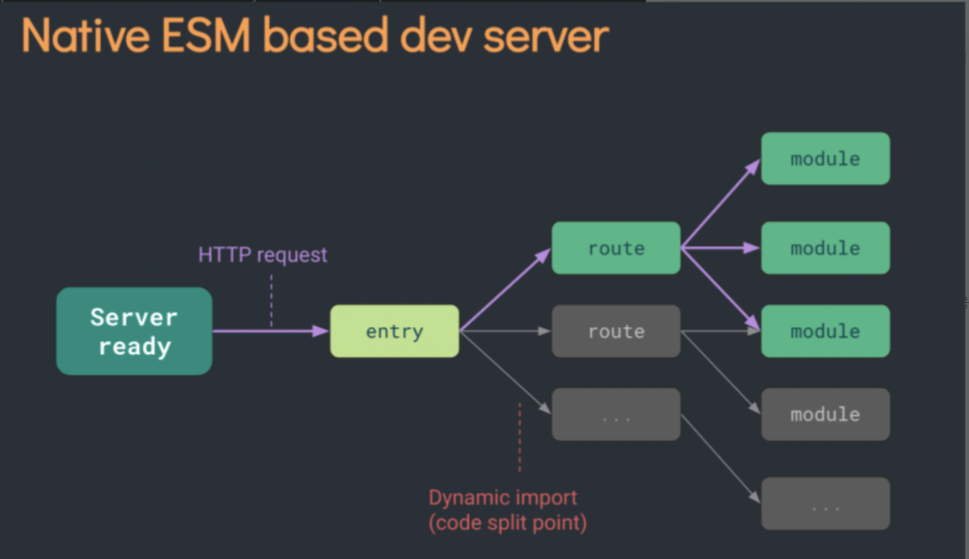

# Webpack 和 Vite 对比

TODO:  添加更加真实的数据对比、打包生成产物的对比
TODO： 在使用层面的对比

- webpack 是一个用于`现代 JavaScript` 应用程序的 `静态模块` `打包工具`(对标 Rollup)
- Vite 是一个更上层的工具链方案，对标的是 (webpack + 针对 web 的常用配置 + webpack-dev-server)

## 一、开箱即用，配置简单

- 由于 Webpack 没有预设场景，设计的十分灵活，导致配置项复杂，插件机制和内部逻辑晦涩难懂。即使是最常见的 WEB 场景也需要大量的配置。并且大量的 loader 之间虽然单独发布但是却隐藏隐式耦合(各种版本之间)。
- Vite 则预设了场景 `WEB`,并且将大部分常见的 WEB 构建需求都直接做成了默认的配置(TS JS ES6 file CSS SCSS font 等)，并且 Vite 也提供了脚手架方便集成 ESlint Prettier TS Test。

## 二、构建项目的区别

### webpack

1. Webpack 在启动时，会先构建项目模块的依赖图，如果在项目中的某个地方改动了代码，Webpack 则会对相关的依赖重新打包，随着项目的增大，其打包速度也会下降。

### Vite

- `Vite` 其核心原理是利用浏览器现在已经支持 ES6 的 import,碰见 import 就会发送一个 HTTP 请求去加载文件，Vite 启动一个 koa 服务器拦截这些请求，并在后端进行相应的处理将项目中使用的文件通过简单的分解与整合，然后再以 ESM 格式返回返回给浏览器。Vite 整个过程中没有对文件进行 `打包编译`，做到了真正的 `按需加载`，所以其运行速度比原始的 webpack 开发编译速度快出许多
- Vite 以 原生 ESM 方式提供源码。这实际上是让浏览器接管了打包程序的部分工作
- 在开发阶段使用 ESbuild 进行 `转译`。Esbuild 则选择使用 Go 语言编写能够充分利用 CPU 的多核性能。Esbuild 具有非常快的速度，打包速度却是其他工具的 10 ～ 100 倍。(快就一个字，开发时能实现秒开)

- 在生产环境下使用 Rollup 进行打包。尽管 esbuild 速度更快，但 Vite 采用了 Rollup 灵活的插件 API 和基础建设，这对 Vite 在生态中的成功起到了重要作用。目前来看，我们认为 Rollup 提供了更好的性能与灵活性方面的权衡。

