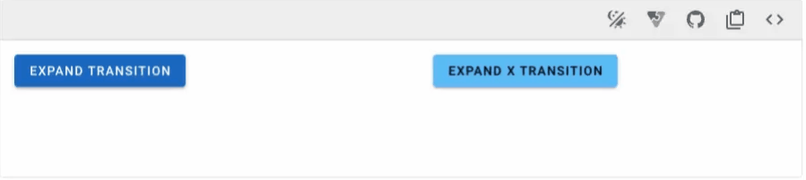
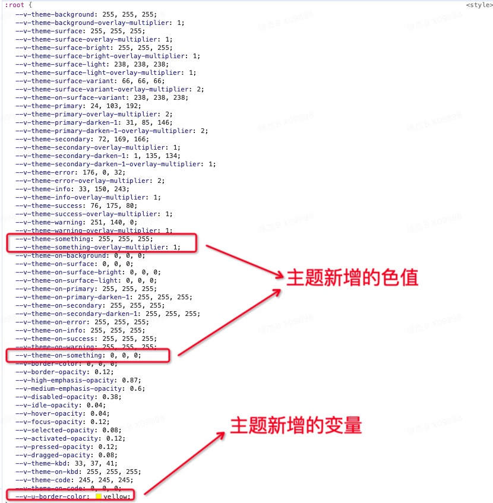
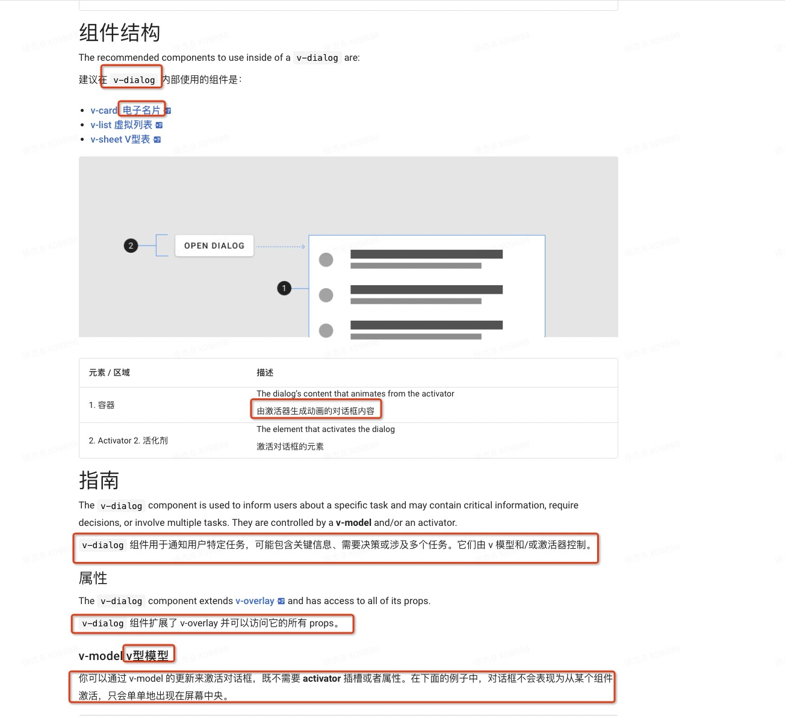

# Vuetify 组件库试用

- Github Star 38.8k
- 采用 Google 推出的 Material Design 设计语言

## 一、布局

- Vuetify 提供了一个应用布局系统以便于轻松创建复杂的网站设计

1. v-app-bar 一个放置导航组件、品牌展示、搜索栏和操作按钮的容器
2. v-system-bar 取代原生手机系统栏的系统栏
3. v-navigation-drawer 一个持有站点导航链接的持久性或临时性的容器
4. v-footer 一个替换默认的 html 页脚的通用组件
5. v-bottom-navigation 一个具有导航链接且通常用于较小设备的持久性或临时性的容器

```html
<!-- App.vue -->
<!-- v-app 是整个 Vuetify 组件的挂载点，全局只能有一个 -->
<v-app>
  <!-- 取代原生手机系统栏 -->
  <v-system-bar class="d-flex justify-center"> Vuetify 组件演示 </v-system-bar>
  <!-- 在 v-main 中放置页面内容 -->
  <v-main>
    <router-view />
  </v-main>
</v-app>
```

## 二、全局配置

### 2.1 Vuetify 允许您在设置应用程序时全局或每个组件设置默认 prop 值

- 详见：容器组件 - 按钮

```ts
// plugins/vuetify.ts
import { createVuetify } from "vuetify";
import { VBtn } from "vuetify/components";

// 导出 vuetify 实例
export default createVuetify({
  // 使用别名，在原组件的基础上派发出新的组件
  aliases: {
    VBtnSecondary: VBtn,
    VBtnTertiary: VBtn,
  },
  defaults: {
    // 为组件自定义 prop
    VBtn: {
      color: "#f3f4f7",
    },
    // 定义的新组件可以直接在项目中使用
    VBtnSecondary: {
      color: "secondary",
      variant: "flat",
    },
    VBtnTertiary: {
      rounded: true,
      variant: "plain",
    },
    // 禁用所有组件的波纹
    global: {
      ripple: false,
    },
    // 定义嵌套在 card 中的 btn 组件 variant 属性
    VCard: {
      VBtn: { variant: "outlined" },
    },
  },
});
```

### 2.2 默认提供程序允许您为应用程序的某个部分中的组件提供特定的默认 prop 值

```ts
// defaults 属性与 createVuetify 的 defaults 一致(也可以使用全局定义的别名)
// xxx-xxx.vue
<v-defaults-provider
  :defaults="{'VBtn':{'color':'primary','size':'large','variant':'tonal'}}">
  <v-btn>Button</v-btn>
</v-defaults-provider>
```

## 三、组件内 SASS 变量

- Vuetify 使用 SASS/SCSS 来设计框架所有方面的样式和外观，每个组件都对外暴露了 scss 变量(文档中可查)，通过对 SCSS 变量的覆盖即可达到全局的样式覆盖效果

```scss
// 修改当前文件后，需要重新编译项目后才会生效
// NOTE: 有些属性可以在多个地方进行配置，权重关系如下
// 权重关系：settings.scss < 组件内 < vuetify.ts < 组件内 + ！important

// style/settings.scss
@use "vuetify/settings" with (
  // btn
  $button-height: 40px,
  $button-banner-actions-padding: 16px
);
```

## 四、样式和动画

### 4.1 CSS reset

- 不同的浏览会为 DOM 元素注入不同的样式(各浏览器的标准不尽相同)，CSS 重置就是为了消除这些差异
- Vuetify 内置 CSS reset, 可以在 settings.scss 文件中通过 `$reset: false` 来禁用

> 应用 box-sizing: border-box 到所有元素.
> 重置所有元素的 padding 和 margin .
> 在所有元素和为元素中指定 background-repeat: no-repeat .
> 继承 text-decoration 和 vertical-align 到 ::before 和 ::after.
> 在所有的浏览器中移除悬停时的 outline .
> 指定 code 元素的字体为 font-family: monospace .
> 重置 input 元素的 border-radius .
> 指定表单元素的字体继承。
> 移除所有浏览器中的默认按钮样式。
> 指定文本区域的大小调整为垂直。
> 应用 cursor: pointer 到按钮元素.
> 在 html 中应用 tab-size: 4 .
> 像标准 input 一样的 select 样式.
> 由 aria 属性设置 cursor 样式.
> 隐藏屏幕上的内容，但不隐藏屏幕阅读器。

### 4.2 动画

- 当前的 H5 项目确实在动画方面存在一定的短板，页面的操作显得生硬不流畅



```html
<v-btn class="ma-2" color="primary" @click="expand = !expand">
  Expand Transition
</v-btn>

<!-- 被 v-expand-transition 组件包含的内容将拥有动画效果 -->
<v-expand-transition>
  <v-card
    v-show="expand"
    class="mx-auto bg-secondary"
    height="100"
    width="100"
  ></v-card>
</v-expand-transition>
```

TODO： Vue 路由切换级别的动画效果实现

### 4.3 调色板

- 开发者可以直接访问 Vuetify 提供的 颜色值，并通过 scss 和 JS，这些值可以在样式表、组件、color 属性上使用

```html
// 语法格式为：{color}-{lighten|darken}-{n}
<v-btn color="red-lighten-3"> no One </v-btn>
```

- 规范中的每种颜色都会转换为背景和文本变体，以便通过 `类名` 在应用程序中进行样式设置

```scss
// text语法格式： text-{color}-{lighten|darken}-{n}
// 背景色语法格式：bg-{color}-{lighten|darken}-{n}
<v-btn class="text-red-lighten-3 bg-grey-lighten-3">
  no One
</v-btn>
```

TODO：unocss 原子化 CSS 的第三方框架

### 4.4 工具类

- Vuetify 将常用的 CSS 样式(阴影、颜色、间距、flex)集合都封装成了 CSS 类名，我们仅需要添加类名便能得到对应的样式，很少需要手动去写 CSS 样式代码
- 通过 js 执行操作 CSS 样式会比较繁琐，在 Vuetify 中可以直接用 JS 来操作类名(操作类名较简单)，来实现改变样式的效果
- 和传统 css 开发形式的好处：1. 项目能达到统一的样式风格 2. 用 vuetify 提供的类名能够更好的实现响应式开发(配合断点去使用)

1. border-radius 辅助类 详见：工具类 - 边距圆角

2. 显示辅助类
   .d-{value} 用于 xs, value: none inline inline-block block table table-cell table-row flex inline-flex
   .d-{breakpoint}-{value} for sm, md, lg, xl, and xxl

| 屏幕大小           | 类名                          |
| :----------------- | :---------------------------- |
| 全部隐藏           | .d-none                       |
| 仅在 xs 大小时隐藏 | .d-none .d-sm-flex            |
| 仅在 sm 大小时隐藏 | .d-sm-none .d-md-flex         |
| 全部可见           | .d-flex                       |
| 仅在 xs 大小时可见 | .d-flex .d-sm-none            |
| 仅在 sm 大小时可见 | .d-none .d-sm-flex .d-md-none |

3. 阴影辅助类
   .elevation - {n} 0~24 n 越大，阴影明显 详见：工具类 - 阴影

4. 弹性布局辅助类

| flex 辅助类                                      | 编译结果                           |
| :----------------------------------------------- | :--------------------------------- |
| .d-flex                                          | display: flex !important;          |
| .flex-fill                                       | flex: 1 1 auto !important;         |
| .flex-0-1-100(好像只有 100 才生效，其他值不可以) | flex: 0 1 100% !important;         |
| .flex-row                                        | flex-direction: row !important     |
| .justify-center                                  | justify-content: center !important |
| 以上的所有类名均可以加上断点使用                 | ....                               |

5. 尺寸工具类

- 感觉这个并不全面，只能使用百分值， UnoCSS 等插件都是可以使用 `w-10px` 这种形式的，更加灵活方便

```scss
.{prefix}-{size}
prefix: h(高) w(宽)
size: auto screen 0 25 50 75 100 // screen 仅高度可用， 数字对应的是百分比
```

6. 间距工具类，文本和排版工具类(详尽去看文档)

```scss
间距工具类格式：.{property}{direction}-{breakpoint}-{size}
文本工具类格式：.text-{breakpoint}-{value}
```

## 五、响应式布局

- 栅格系统、显示辅助类、断点

### 5.1 断点

- Vuetify 还在 JS 层面提供了当前设备的类型，拥有 JS 代码的响应式适配(eg: 按钮点击后 pc 需要弹窗再次确认，移动端则直接进行操作)
- 裁定断点，在不同的断点内应用不同的样式
- 移动优先(xs 可忽略)： .text-xs-h1 除了手机外，还能向上影响其他的断点，.text-md-h1 笔记本、桌面端、超大屏

| 范围              | 类型                             | 代码 |
| :---------------- | :------------------------------- | :--- |
| < 600px           | 小型到大型的手机                 | xs   |
| 600px > < 960px   | 小型到中型的平板                 | sm   |
| 960px > < 1280px  | 大型平板到笔记本电脑             | md   |
| 1280px > < 1920px | 从笔记本电脑到桌面电脑           | lg   |
| 1920px > < 2560px | 分辨率 1080p 到 1440p 的桌面电脑 | xl   |
| > 2560px          | 4K 和超宽屏幕                    | xxl  |

### 5.2 栅格布局

- Vuetify 配备了一个使用 flexbox 构建的 12 点网络系统
- 栅格布局可以搭配着`断点`进行使用
- 详见：容器组件 - 栅格布局

```html
<!-- 容器 -->
<v-container>
  <!-- 行 -->
  <!-- align="center"  ->  align-items: center; -->
  <v-row align="center" style="height: 150px;" class="bg-surface-variant">
    <!-- 列 -->
    <v-col cols="4">
      <v-card title="center" text="cols 4"></v-card>
    </v-col>
    <v-col cols="4">
      <v-card title="center" text="cols 4"></v-card>
    </v-col>
  </v-row>
</v-container>
```

```html
<v-row align="center" style="height: 150px;" class="bg-surface-variant mt-4">
  <!-- 列 -->
  <!-- align-self="end" ->  align-self: end; -->
  <v-col cols="4" align-self="end">
    <v-card title="end" text="cols 4"></v-card>
  </v-col>
  <v-col cols="4">
    <v-card title="center" text="cols 4"></v-card>
  </v-col>
</v-row>
```

```html
<!-- justify="center"   -> justify-content: center; -->
<v-row
  align="start"
  style="height: 150px;"
  class="bg-surface-variant mt-4"
  justify="center"
>
  <v-col cols="6">
    <v-card title="start/center" text="cols 6"></v-card>
  </v-col>
  <v-col cols="4">
    <v-card title="start/center" text="cols 4"></v-card>
  </v-col>
</v-row>
```

```html
<v-row align="center" style="height: 150px;" class="bg-surface-variant mt-4">
  <!-- 列 -->
  <v-col cols="4">
    <v-card title="不偏移" text="cols 4"></v-card>
  </v-col>
  <v-col cols="4" offset="4">
    <v-card title="偏移" text="cols 4 offset 4"></v-card>
  </v-col>
</v-row>
```

## 六、主题

### 6.1 主题的切换

- Vuetify 预装了两个主题 `dark` `light`

```ts
// 1. 配置默认主题
// vuetify.ts
export default createVuetify({
  theme: {
    defaultTheme: 'dark'
  }
})

// 2. 可以在运行时通过 JS 逻辑来更换主题
<script lang="ts" setup>
// 使用 Theme 相关 API
import { useTheme } from 'vuetify'
const theme = useTheme()

// 点击按钮进行主题的切换
function toggleTheme () {
  theme.global.name.value = theme.global.current.value.dark ? 'light' : 'dark'
}
</script>
```

### 6.2 自定义主题

- Vuetify 支持用户自定义主题

#### (1)定义主题的内容

```ts
// 1. 自定义主题
// plugins/vuetify.ts
import { createApp } from "vue";
import { createVuetify, type ThemeDefinition } from "vuetify";
const myCustomLightTheme: ThemeDefinition = {
  dark: false,
  colors: {
    background: "#FFFFFF",
    surface: "#FFFFFF",
    "surface-bright": "#FFFFFF",
    "surface-light": "#EEEEEE",
    "surface-variant": "#424242",
    "on-surface-variant": "#EEEEEE",
    primary: "#1867C0",
    "primary-darken-1": "#1F5592",
    secondary: "#48A9A6",
    "secondary-darken-1": "#018786",
    error: "#B00020",
    info: "#2196F3",
    success: "#4CAF50",
    warning: "#FB8C00",
    something: "#00ff00", // 自定义的一个颜色
  },
  variables: {
    "border-color": "#000000",
    "border-opacity": 0.12,
    "u-border-color": "red", // 自定义的一个颜色变量
  },
};
export default createVuetify({
  theme: {
    defaultTheme: "myCustomLightTheme",
    themes: {
      myCustomLightTheme,
    },
  },
});
```

#### (2)使用主题的内容

1. background、surface、primary 等是 Vuetify 内置的色值
2. something 是用户自定义的色值，Vuetify 将生成许多 `CSS` 类和变量供你在应用程序中使用

```html
<!-- 在 HTML 中使用 -->
<div class="bg-something">background color</div>
<div class="text-something">text color</div>
<div class="border-something">border color</div>
<!-- 在 CSS 中使用, 前缀是 --v-theme- -->
.btn { background-color: rgb(var(--v-theme-something)); }
```

3. border-color、border-opacity 是 Vuetify 内置的变量
4. u-border-color 是用户自定义的变量

```css
.btn {
  border: 5px solid var(--v-border-color);
  border: 5px solid var(--v-u-border-color);
}
```



### 6.3 局部主题

- Vuetify 支持一个应用程序中同时存在多种主题

```html
<!-- 1. 大部分组件都支持 theme prop, 并且该主题会影响自身以及所有子组件 -->
<v-card theme="dark">
  <!-- button uses dark theme -->
  <v-btn>foo</v-btn>
</v-card>

<!-- 2. 为应用程序的大块部分设置主题 -->
<v-theme-provider theme="high-contrast">
  <!-- uses the high-contrast theme -->
  <v-card>...</v-card>
  <v-btn>...</v-btn>
</v-theme-provider>
```

## 七、vscode 适配

- vuetify-vscode 是在 Visual Studio 代码中工作时 Vuetifyjs 的官方扩展。它为 Vuetifyjs 提供片段和自动完成功能。

## 八、tree-shaking

- tree-shaking：移除 JavaScript 上下文中的未引用代码 (dead-code)
- 依赖于 ES2015 的模块语法. 模块的导入（import）和导出（export）语句必须是静态的，也就是说，导入和导出的内容在编译时就能确定，而不是在运行时。这样工具链才能分析出哪些模块或哪些导出是实际被使用的。
- Vuetify 自动支持 tree-shaking 而无需手动导入

## 九、基础组件的使用

- 示例中使用的全是 Vue3 的语法，在学习官网之前请先掌握 Vue3 的基础语法，重点学习插槽，具名插槽，作用域插槽。v-bind 语法。解构赋值
- Vuetify 实例语法比较多变。prop、作用域插槽、子组件的形式

```html
<v-dialog>
  <template v-slot:activator="{ props: activatorProps }">
    <v-btn v-bind="activatorProps" variant="flat"></v-btn>
  </template>

  <template v-slot:default="{ isActive }">
    <v-card title="Dialog">
      <v-card-text> text </v-card-text>
      <v-card-actions>
        <v-spacer></v-spacer>
        <v-btn text="Close Dialog" @click="isActive.value = false"></v-btn>
      </v-card-actions>
    </v-card>
  </template>
</v-dialog>
```

### 9.1 骨架的功能

- 当前 H5 页面的一个较大缺陷，加载 -> 加载完成 这个过程，页面会由`空白`变成`有内容`。页面的切换比较生硬。
- Vuetify 内置了诸多内置类型：actions， article，avatar，button，card ......
- 详见：容器组件-骨架

```html
<!-- 1. 可以基于内置类型进行自身的翻倍 -->
<v-skeleton-loader type="button@2"> ... </v-skeleton-loader>

<!-- 2.可以基于内置类型进行组合 -->
<v-skeleton-loader type="button, article, card"> ... </v-skeleton-loader>
```

### 9.2 容器组件特点

- 容器组件在设计上更加概念化，每种组件只专注于自身功能的实现，开发者能够通过组合的方式搭建出各种形式的高级组件(`搭建城市的例子`)
- bottom sheets(详见：容器组件-底部弹窗) 仅仅规范了一个底部面板的样式，面板内可以包含的内容是任意的，推荐 `v-card v-list v-sheet` 并且确认，取消按钮的逻辑也需要自己实现 。但是 `u-view picker` 直接在底部面板中内置了 单列，多列，时间，地区等常见场景以及确认，取消按钮，底部安全区。
- u-view 根据业务逻辑，提供了 popup、modal 两个组件。分别适用于不同的场景。 Vuetify 只提供了一个 dialog, 内部的业务逻辑需要自己的书写
- Vuetify 提供了一个 dividers(分割线) 组件，该组件可用于内容分割、列表分割、标题分割(竖线)、表单项分割
- overlay 是覆盖全部页面的组件，可以使用它来创建自定义的弹出式组件
- sheet 组件支持强调效果，圆角，自定义颜色等功能。它既可以作为其他组件的容器也可以单独使用
- card 的演示，详见：容器组件 - 卡片组件展示

### 9.3 其他组件

- 导航式组件
- 表单输入和控制组件
- 数据展示组件
- 选择组件
- 反馈式组件
- 图像和图标组件
- 选择器组件(时间、日期)

### 9.4 注意事项

- Vuetify 组件库不是一个随用随查的框架，需要在使用之前就对其有足够的了解
- Vuetify 的文档对新手不太友好，不推荐全文通读的方式，需要一遍遍的翻阅
- Vuetify 的文档并没有完全汉化，推荐沉浸式翻译的插件，译文不会覆盖原文，而是会排列在原文的下面。



## 十、总结

### 10.1 优点

- 组件的样式比较好看，内置动画效果流程、美观
- 内置功能强大且灵活：主题、全局配置、工具类、骨架、栅格布局、动画等
- 组件的属性丰富，可以方便的进行扩展
- 拥有目前最好的响应式解决方案(断点 + 工具类)

### 10.2 缺点

- 上手难度高：

1. Vuetify 文档学习成本高
2. 功能多、配置项多。掌握起来比较费时间
3. 中文互联网很少有学习资料
4. 如何基于 Vuetify 提供出一个适合团队的方案(功能取舍，重叠部分的选择)，对于技术组来说是一个挑战
5. 不支持各类小程序
