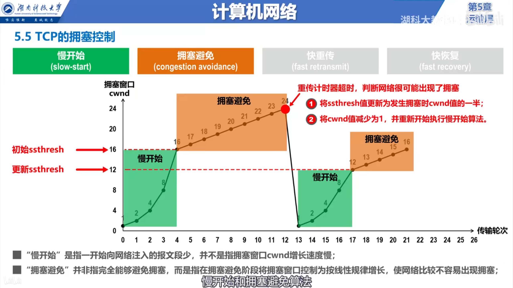

# TCP 协议

* TCP是一种面向连接的，可靠的协议。
* TCP是明文传输的。因为HTTP协议使用的就是TCP协议。所以HTTP是明文的
* TCP仅仅支持单播
* TCP是面向字节流的

## TCP流量控制

* 控制发送方的发送速度，以免发送数据的速度过快，导致接收方来不及全部接收。

## TCP的拥塞控制

* 对网络中某一个资源的需求超过了该资源所能提供的可用部分，网络性能就要变坏，这种情况就叫做拥塞。
* 四种算法： 慢开始，拥塞避免，快重传，快恢复(拥塞窗口大小的意思就是，一次发送能发送TCP报文段的个数)

* 在发生重传计时器超时时，有可能是出现了拥塞，也有可能是出现了报文段的丢失，不搞清楚是什么原因发生了重传计时器超时就直接降低拥塞窗口的大小会降低效率。采用**快重传算法**来区别是发生了拥塞还是发生了丢失，可以有效提高传输效率。
* 快恢复算法： 当使用快重传算法发现有个人报文段丢失时，不在启动**慢开始算法**，而是启动**快恢复算法**。快恢复算法不会直接把拥塞窗口大小直接改为1，而是改为当前窗口大小的一半。

## TCP超时重传时间的选择

* 因为情况的复杂性，需要使用科学的算法来计算出合理的TCP超时重传时间。

## TCP的连接建立

### 使用三报文握手来建立TCP连接

同步位SYN    序号字段seq   确认位ACK    确认号字段ack

* 使用三次握手来建立TCP连接是为了防止已失效的连接请求报文段(在网络中的结点长时间滞留了，延误到连接释放以后的某个时间点才到达服务端)(由于TCP的超时重传特性导致)突然又传送到了TCP服务器。进而导致错误。
  
### 数据传送

### 使用四报文挥手来释放TCP连接

终止位FIN

* 为什么TCP客户端在第二次发送完连接释放报文段后仍需要等待2MSL的时间后才关闭。是为了防止第二次连接释放报文段丢失后，TCP服务端认为他发送的第二次连接释放报文段丢失，所以会启动TCP超时重传。如果此时客户端已经关闭的话，客户端收不到信息，TCP服务端就会一直超时重传。等待两个MSL时间来确保 此次连接中没有剩余的TCP报文段干扰下一次TCP连接。
* 因为TCP是全双工通信的。四次挥手是客户端和服务端分别释放连接的过程。
* 每两次挥手其实是一次释放连接的过程。为什么一次释放需要两次挥手。假如客户端想要断开连接。客户端发送了连接释放请求。如果服务端没有回应，客户端并不知道自己的请求已经正确到达了服务端。每次释放时的第一次挥手是请求，第二次挥手是回应请求已经收到。
* 前两次的挥手是为了关闭从客户端到服务端的TCP连接，两次挥手之后服务器仍然可以给客户端发送少量数据。
* 后两次的挥手是为了关闭从服务端到客户端的TCP连接，至此TCP连接才真正释放。