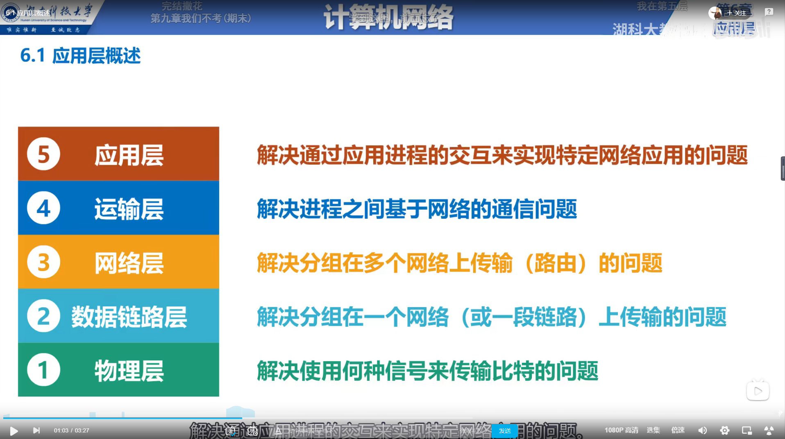
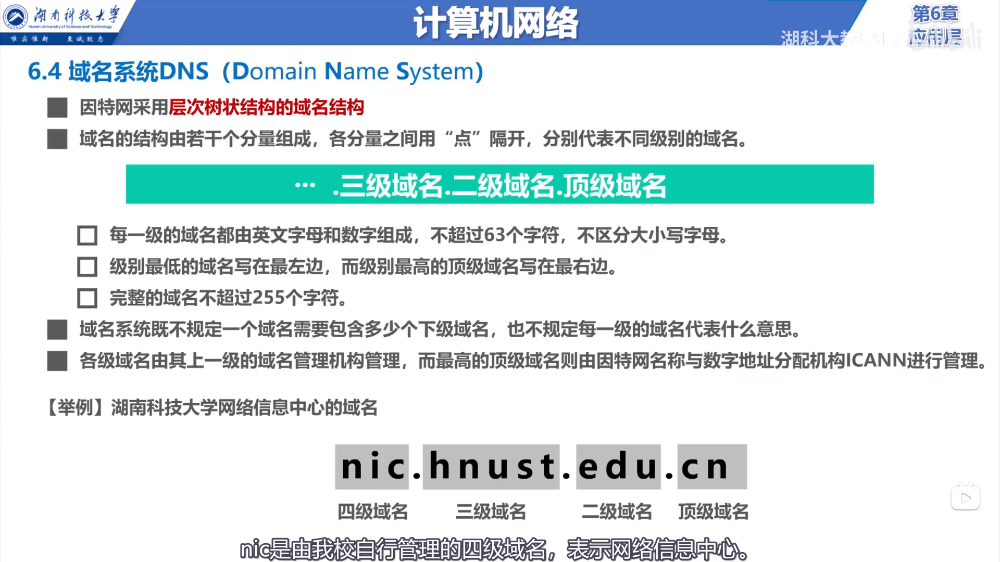
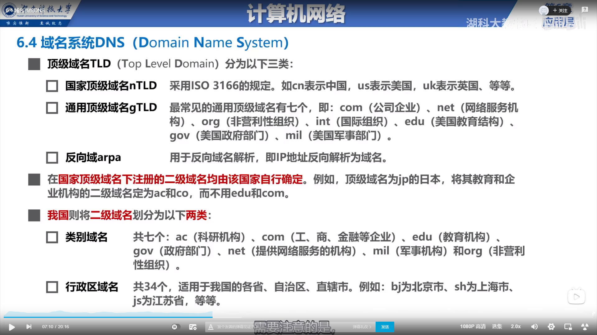

# 应用层

## 客户服务器方式(C/S) 对等方式(P2P)

* 客户服务器方式(C/S)所描述的是进程之间服务与被服务的关系
* 对等方式(P2P)中没有固定的服务请求者和服务提供者 ，对等方互相之间直接通信。

## 动态主机配置协议DHCP

* 个人PC机，开机自动启动DHCP程序，自动的获取该PC机的网络配置信息。(IP地址，子网掩码等)
* 应用层DHCP协议使用运输层的UDP协议提供的服务。

## 域名系统DNS

## 文件传送协议FTP

* FTP是互联网上使用的最广泛的文件传送协议。
* FTP服务器熟知端口号21

## 电子邮件

* 简单邮件传送协议SMTP
