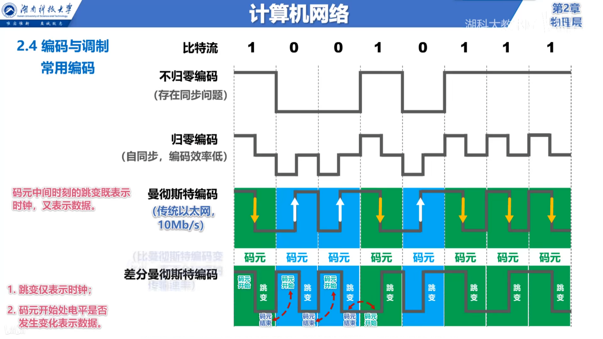

# 物理层

* 为了解决在各种传输媒体上传输比特0和1的问题。
* 物理层为数据链路层屏蔽了各种传输媒体的差异，使数据链路层只需要考虑如何完成本层的协议和服务，而不必考虑具体的网络传输媒体是什么。
* 各种传输媒体并不在计算机网络的任何体系结构中，属于比物理层还下面的概念。

## 传输方式

* 远距离的传输(计算机网络)使用的是串行传输
* 计算机内部(cpu和内存之间通过总线传输)使用的是并行传输，也就是我们常说的32位机和64位机

* 同步传输
* 异步传输

* 单向通信(单工)  无线电 广播等
* 双向交替通信(半双工) 对讲机
* 双向同时通信(全双工) 电话

## 编码和调制

